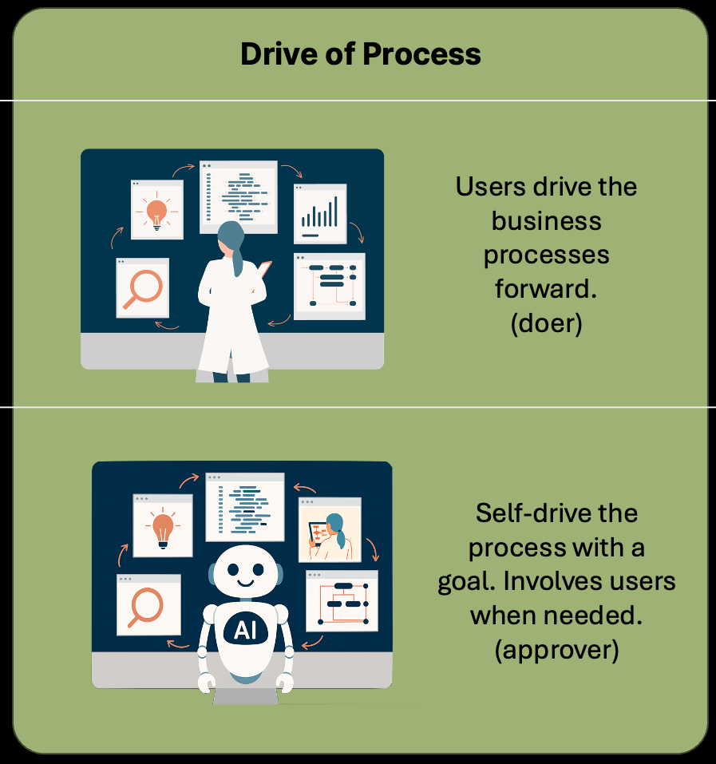
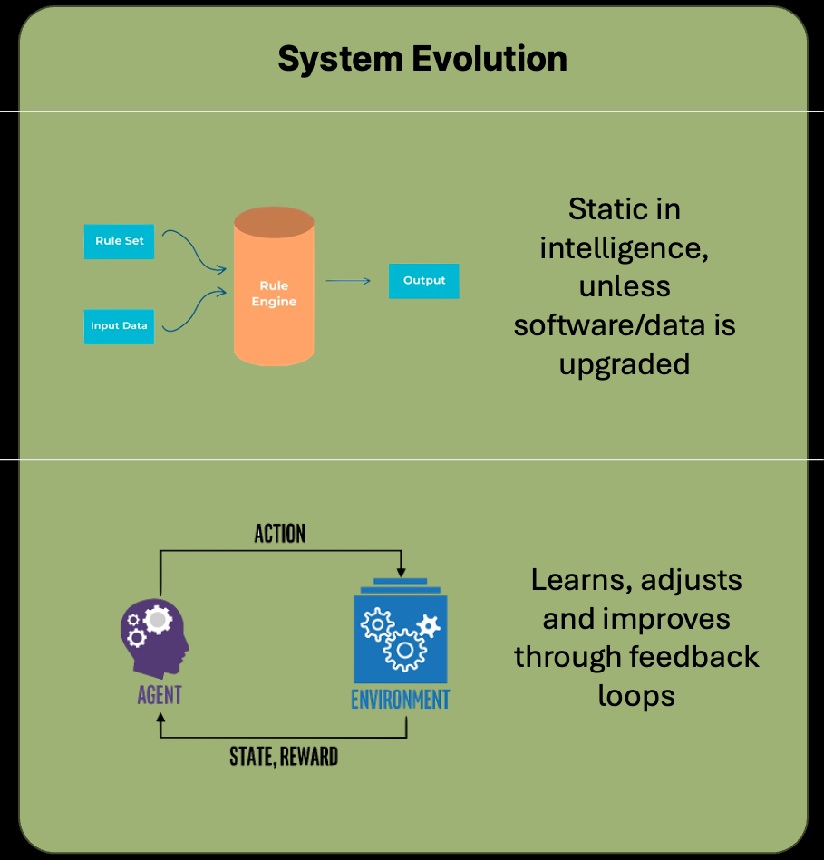
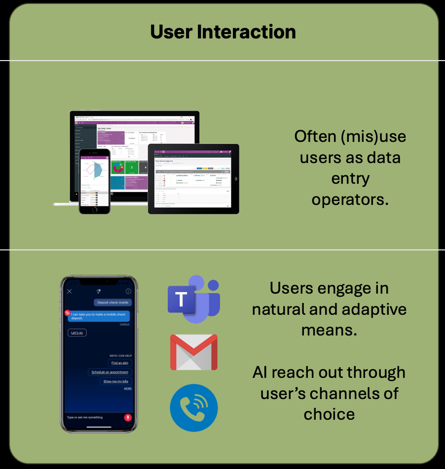

# Why Agentic Platforms are Needed?

Future software will be very different to Conventional software created so far.

There are 3 areas of main differences:

## 1. Drive of Process

| Traditional Software | Agentic Software (Xians Platform) |
|---------------------|-----------------------------------|
| Users drive the business processes forward (doer role) | AI agents self-drive the process with defined goals |
| Manual process execution and decision-making | Autonomous process execution and optimization |
| Human-centric workflow management | Users take on approver role when needed |
| Users responsible for each step of the process | AI involves users strategically rather than for every step |
| | Goal-oriented automation with human oversight |

## 2. System Evolution

| Traditional Software | Agentic Software (Xians Platform) |
|---------------------|-----------------------------------|
| Static intelligence systems | Dynamic learning systems |
| Rule-based engines with fixed logic | Agent-environment feedback loops |
| Intelligence remains unchanged unless software/data is manually upgraded | Continuous learning, adjustment, and improvement |
| Predetermined decision paths and responses | Adaptive intelligence that evolves through experience |
| | State and reward-based optimization |
| | Self-improving capabilities over time |

## 3. User Interaction

| Traditional Software | Agentic Software (Xians Platform) |
|---------------------|-----------------------------------|
| Users often misused as data entry operators | Users engage through natural and adaptive means |
| Form-based interfaces and manual input requirements | AI reaches out through user's preferred channels of choice |
| Limited interaction paradigms | Multi-modal communication (Teams, Gmail, Phone, etc.) |
| Technology-centric user experience | Context-aware and personalized interactions |
| | Human-centric communication patterns |

## Architecture Requirements

To support these capabilities a new type of architecture is needed. This is where agentic platform architecture comes into play.

## Platform Capabilities That Enable Agentic Software

### Autonomous Process Execution

The platform provides several technical capabilities that enable AI agents to drive processes autonomously:

- **Enterprise-Grade Workflow Engine**: Built on [temporal.io](https://temporal.io), providing fault-tolerant, long-running process execution that can operate for months or years
- **Multi-Agent Systems**: Peer-to-peer agent collaboration where agents coordinate complex tasks through explicit workflows or emergent cooperation
- **Event-Driven Communication**: Agents communicate through sophisticated event mechanisms (`SendFlowMessage`, `SubscribeFlowMessageHandler`) enabling complex coordination without tight coupling

### Adaptive Intelligence

Technical features that support continuous learning and adaptation:

- **Knowledge Management System**: Dynamic knowledge bases that can be updated without code changes, allowing agents to evolve their behavior through the portal interface
- **Capabilities Framework**: Extensible tool ecosystem where agents can acquire new abilities through custom capabilities, third-party libraries, or other agents as tools
- **Flow Types**: Support for both deterministic business processes and non-deterministic conversational flows, enabling different levels of autonomy based on requirements

### Natural User Interaction

Platform features that enable human-centric communication:

- **Multi-Modal Communication**: Native integration with WebSocket, REST APIs, and webhooks for reaching users through their preferred channels
- **Agent Handoffs**: Seamless transfer of conversations between specialized agents (`SendHandoff`) when different expertise is required
- **Message Threading**: Structured conversation management with support for both text (`SendChat`) and structured data (`SendData`) communication

### Technical Implementation Details

The platform architecture supports these capabilities through:

- **Multi-Tenant Ready**: Built-in isolation and customization per tenant for enterprise deployments
- **Platform Agnostic**: No vendor lock-in to specific LLMs, providers, or cloud platforms
- **Built-in Observability**: Comprehensive tracing, logging, and evaluation for monitoring agent behavior
- **Simplified Deployment**: Container support with standardized interfaces for flexible deployment options

These technical capabilities work together to enable the fundamental shift from traditional software patterns to autonomous, adaptive, and naturally interactive agentic systems.
