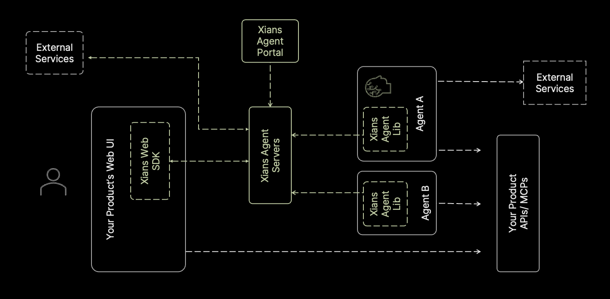

# Xians Platform Components

## Primary Platform Components

### Xians Web SDK

- [Github Repository](https://github.com/XiansAiPlatform/sdk-web-typescript)
- [NPM Package](https://www.npmjs.com/package/@99xio/xians-sdk-typescript)

This helps developers to easily communicate with Agents from their web front ends. It is a wrapper around the Xians server's Websocket, REST and SSE APIs and provides a simple interface to interact with the agents. If someone wishes to bypass the SDK and directly communicate with the server, they can use the [Xians Server APIs](https://github.com/XiansAiPlatform/XiansAi.Server/blob/main/XiansAi.Server.Src/docs/user-api/index.md).

### Xians Server

- [Github Repository](https://github.com/XiansAiPlatform/XiansAi.Server)
- [Docker Images](https://hub.docker.com/repository/docker/99xio/xiansai-server/general)

This is the core of the Xians Platform. It is a server that manages the communication, agents, workflows, and other components of the platform.

### Xians Agent Lib

- [Github Repository](https://github.com/XiansAiPlatform/XiansAi.Lib)
- [NuGet Package](https://www.nuget.org/packages/XiansAi.Lib)

Agents are developed as commandline applications. This library provides the ability for the agents to communicate with the Users, Xians server and fellow agents.

### Xians Agent Portal

- [Github Repository](https://github.com/XiansAiPlatform/XiansAi.UI)
- [Docker Image](https://hub.docker.com/repository/docker/99xio/xiansai-ui/general)

This is the portal that allows the users to manage and monitor the agents.
