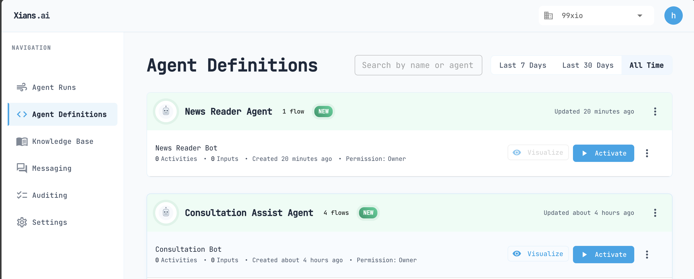
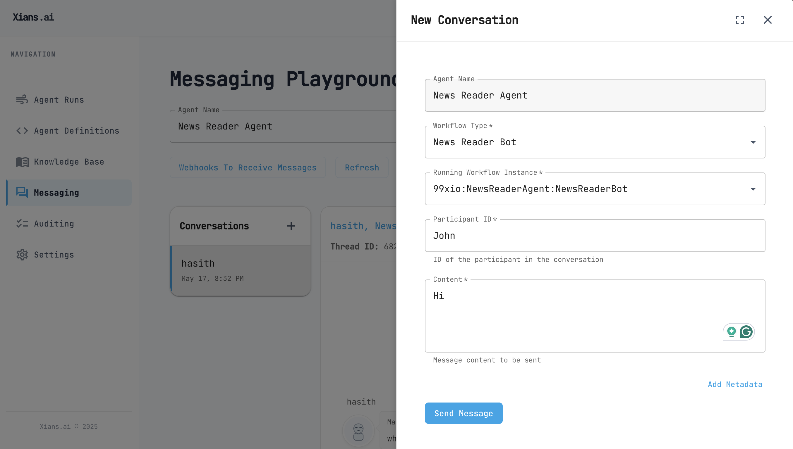

# Setting Up an Agent Project

## Prerequisites

Before you begin, ensure you have installed:

- [.NET 9 SDK](https://dotnet.microsoft.com/en-us/download/dotnet/9.0)

## Creating Your Project

Xians.ai agents run as standard .NET applications, which can be executed locally or deployed to any server environment. Let's create a new project:

```bash
dotnet new console -n <Agent-Name>
cd <Agent-Name>
```

## Installing the SDK

Add the Xians.ai SDK to your project:

```bash
dotnet add package XiansAi.Lib
```

## Understanding the Platform

The XiansAi platform consists of two main components:

### App Server

- Manages your agents and knowledge
- Provides monitoring and visualization
- Handles agent administration

### Flow Server

- Executes your agents
- Manages agent state and persistence
- Handles distributed execution

## Configuration Setup

For better security and maintainability, use a .env file to manage your configuration:
You can use a package like [DotNetEnv](https://github.com/tonerdo/dotnet-env) to load the environment variables from the `.env` file without hardcoding them in your code.

Install the DotNetEnv package:

```bash
dotnet add package DotNetEnv
```

Create a `.env` file in the root of your project with the following content:

``` .env
# Platform environment variables

FLOW_SERVER_URL=
FLOW_SERVER_NAMESPACE=
FLOW_SERVER_API_KEY=

APP_SERVER_URL=
APP_SERVER_API_KEY=
```

Replace the values with values obtained from the `Settings` page in the Xians.ai portal.

Update your Program.cs:
`Program.cs >`

```csharp
using XiansAi.Flow;
using DotNetEnv;

// Load the environment variables from the .env file
Env.Load();

// name your agent
var agentInfo = new AgentInfo("News Reader Agent");

// create a new runner for the agent
var newsReaderBot = new Runner<NewsReaderBot>(agentInfo);
await newsReaderBot.RunAsync();
```

## Add a conversation bot to the agent

Agents can be configured to have multiple workflows (business processes). One type of workflow is a conversation bot. This is a bot that can be used to interact with the users.

To add a conversation bot to the agent, you need to add a new class to the agent project.

`NewsReaderBot.cs>`

```csharp 
using Temporalio.Workflows;
using XiansAi.Flow;

[Workflow("News Reader Bot")]
public class NewsReaderBot : FlowBase
{

    [WorkflowRun]
    public async Task Run()
    {
        string sysPrompt = "You are a news reader bot.";
        await InitUserConversation(sysPrompt);
    }
}

```

Notes:

- The `[WorkflowRun]` and `[Workflow]` attributes are required to mark the method as the entry points for the workflow. You can see more about the Temporal.io workflow engine [here](https://docs.temporal.io).

- InitUserConversation is a method that initializes the conversation with the user. It is a method that is provided by the XiansAi.Flow library.

## Testing Your Setup

Run the application requesting to test the configuration:

```bash
dotnet run
```

If no errors occur, your agent is now deployed to the Xians.ai platform. 

Note: You will have a `Warning` which we will fix in the next step.

Log in to the Xians.ai Manager portal and you will see your agent under `Agent Definitions`.



Click `Activate` and activate a Singleton Flow Run.

Now in the `Messaging` playground you can start a conversation with your agent.



You can see the conversation history and the agent's response.

## Visualizing the Flow's Logic

You may have noted the `Warning` in the previous step. Also the disabled `Visualize` button in the portal.

This is because the flow class file is not included in deployed package. Let's fix this.

Add the following in your .csproj file:

```xml
<Project Sdk="Microsoft.NET.Sdk">
...

  <ItemGroup>
    <!-- Embed the flow source files -->
    <EmbeddedResource Include="NewsReaderBot.cs">
        <LogicalName>%(Filename)%(Extension)</LogicalName>
    </EmbeddedResource>
  </ItemGroup>

</Project>

```

Now you can run the agent again and you will see the `Visualize` button enabled in the portal.
