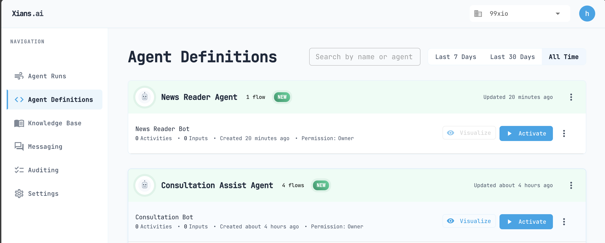
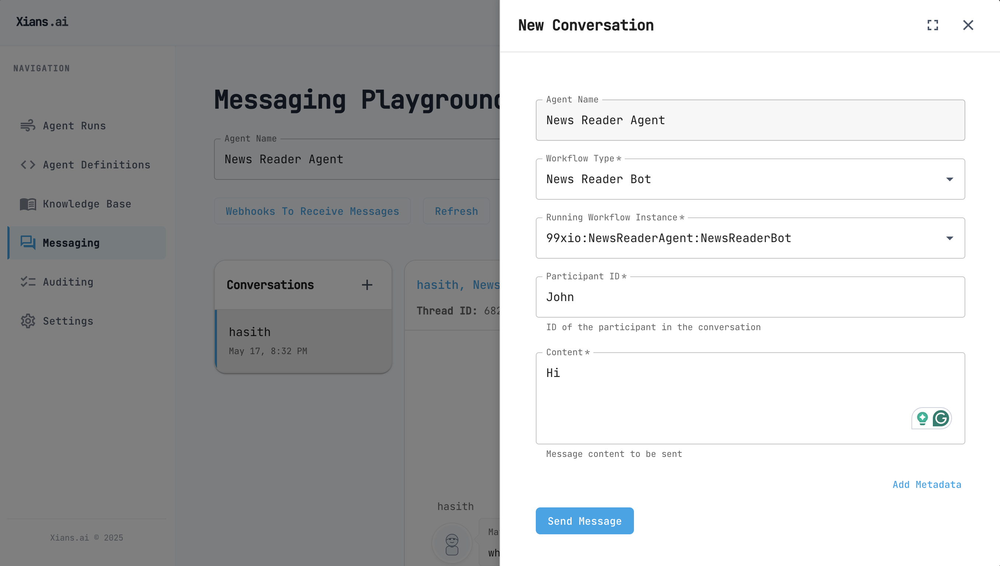
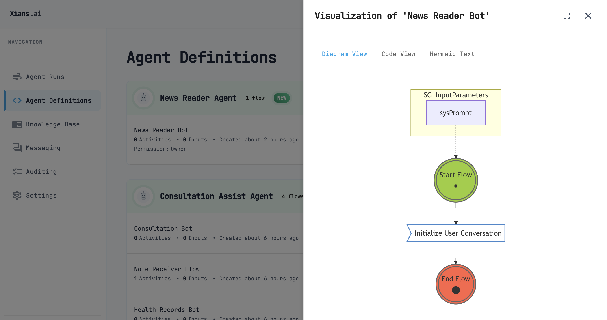

# Your First Conversational Flow

AI agent could have a multiple workflows. However in this example, we will create a simple agent with a single Flow which is a conversation bot.

## Creating a Conversational Flow

Update your Program.cs:
`Program.cs >`

```csharp
using XiansAi.Flow;
using DotNetEnv;

// Load the environment variables from the .env file
Env.Load();

var options = new RunnerOptions {
   SystemScoped = true
}; 

// name your agent
var agent = new AgentTeam("News Agent", options);

var bot = agent.AddAgent<NewsReaderBot>();

await agent.RunAsync();
```

## Add a conversation bot to the agent

Agents can be configured to have multiple workflows (business processes). One type of workflow is a conversation bot. This is a bot that can be used to interact with the users.

To add a conversation bot to the agent, you need to add a new class to the agent project.

`NewsReaderBot.cs>`

```csharp
using Temporalio.Workflows;
using XiansAi.Flow;

[Workflow("News Agent:News Reader Bot")]
public class NewsReaderBot : FlowBase
{
    public NewsReaderBot(){
        SystemPrompt = "You are a news reader bot.";
    }

    [WorkflowRun]
    public async Task Run()
    {
        await InitConversation();
    }
}

```

!!! Important
    Bot and Flow names must follow the naming convention `<agent-name>:<flow-name>`. 
    
    In the example above, `"News Agent:News Reader Bot"` uses the agent name "News Agent" followed by a colon and the specific flow name "News Reader Bot". This ensures proper organization and identification of flows within your agent.

Notes:

- The `[WorkflowRun]` and `[Workflow]` attributes are required to mark the method as the entry points for the workflow. You can see more about the Temporal.io workflow engine [here](https://docs.temporal.io).

- InitConversation is a method that initializes the conversation with the user. It is a method that is provided by the XiansAi.Flow library.

- The InitConversation function is designed for flexibility and supports two usage patterns:
    -   Providing a system prompt (string): Users can directly pass a system prompt to define the initial context or instructions for the conversation.
    - Providing a knowledge object: Users can specify a Knowledge object that includes a knowledge name, allowing the conversation to be initialized based on a predefined knowledge base or content source.


## Testing Your Setup

!!! Important
    If you get a warning about another user using the same agent, you should change the agent name to something else.
    
    One tenant can have only one agent with the same name. 
    
    For example,
    `News Agent` is already taken, so you should use `News Reader Agent - xyz` or something like that.

Run the application requesting to test the configuration:

```bash
dotnet run
```

If no errors occur, your agent is now deployed to the Xians.ai platform.

Note: You will have a `Warning` which we will fix in the next step.

Log in to the Xians.ai Manager portal and you will see your agent under `Agent Definitions`.



Click `Activate` and activate a Singleton Flow Run.

Now in the `Messaging` playground you can start a conversation with your agent.



You can see the conversation history and the agent's response.

## Visualizing the Flow's Logic

You may have noted the `Warning` in the previous step. Also the disabled `Visualize` button in the portal.

This is because the flow class file is not included in deployed package. Let's fix this.

Add the following in your .csproj file:

```xml
<Project Sdk="Microsoft.NET.Sdk">
...

  <ItemGroup>
    <!-- Embed the flow source files -->
    <EmbeddedResource Include="NewsReaderBot.cs">
        <LogicalName>%(Filename)%(Extension)</LogicalName>
    </EmbeddedResource>
  </ItemGroup>

</Project>

```

Now you can run the agent again and you will see the `Visualize` button enabled in the portal.

```bash
dotnet run
```

You will see the `Visualize` button enabled in the portal.



Click the `Visualize` button and you will see the flow's logic.

## Conversational Flows are Non-Deterministic

Non-deterministic flows don't follow a predefined path that executes the same way each time. Instead, the flow's execution is determined at runtime, leveraging AI models and available data to make decisions about next steps.
Unlike deterministic processes where every step must be explicitly modeled beforehand, non-deterministic flows adapt dynamically. This approach offers several advantages:

- Faster development: Reduced need for extensive process design and testing
- Improved accessibility: Business users can automate processes without deep technical expertise
- Enhanced personalization: Flows can adapt to individual user needs and contexts
- Greater flexibility: The system can handle complex scenarios that would be difficult to model explicitly

In deterministic systems, processes that can't be fully defined in advance typically require human intervention. Non-deterministic flows can increase automation in these scenarios, such as customer support, content generation, or decision-making tasks that traditionally needed human judgment.

However, non-deterministic flows also present challenges, including less predictable behavior, potentially higher execution costs, and more complex auditing requirements. If the business process is well-known and requires repeatable results, then a deterministic flow is a better choice.

To learn about deterministic flows, please refer to [Process Automation](../4-automation/0-introduction.md).

## Next Steps

- [Adding Capabilities](3-adding-capabilities.md)
