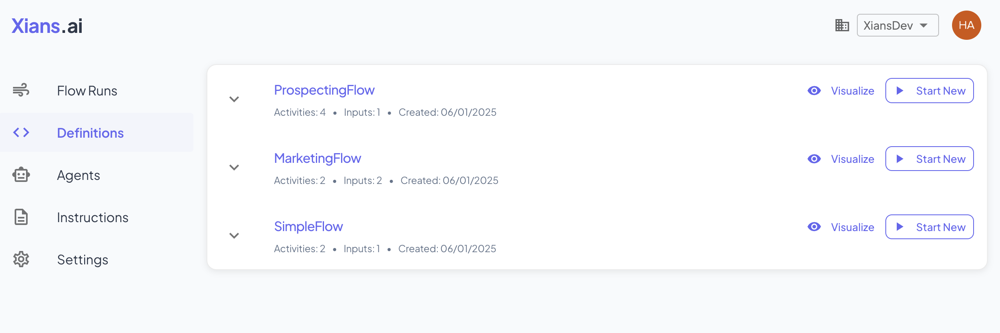
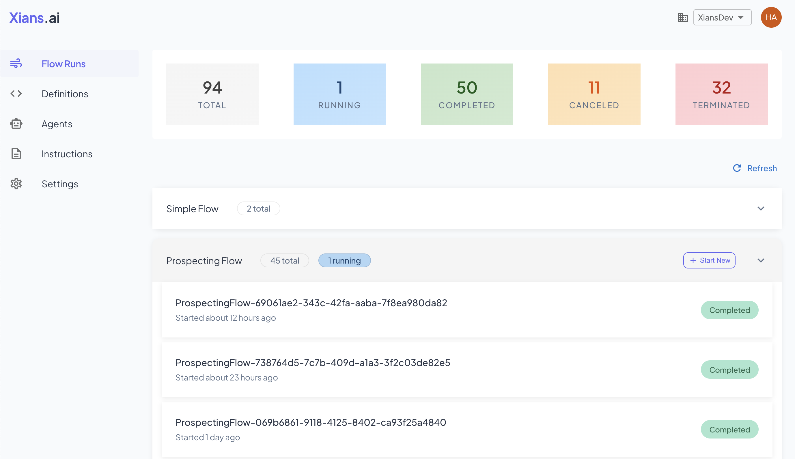

# Your First Agent

## Creating an Agent

To create a new agent, create a class that inherits from `XiansAi.Flow.FlowBase`.

!!! note "Tip"
    This example demonstrates a simple agent. In later sections, we'll explore more complex agents using `Agents` and `Instructions`.

`SimpleAgent.cs >`

```csharp
using Temporalio.Workflows;
using XiansAi.Flow;

[Workflow]x
public class SimpleAgent: FlowBase
{
    [WorkflowRun]
    public async Task<string> Run(string name)
    {
        var output = "Hello";
        await DelayAsync(TimeSpan.FromSeconds(10));
        output += " World " + name;
        return await Task.FromResult(output + $" {name}!");
    }
}
```

!!! warning "Important"
    Each agent name must be unique within your organization. You can view existing agent definitions in the XiansAI portal. To customize an agent's name, use the [Workflow] attribute:
    ```csharp
    [Workflow("My New Named Agent")]
    public class SimpleFlow: FlowBase
    ```

!!! abstract "Did you know?"
    Xians.ai supports long-running (persistent) agents. This means your agent can be paused for days or months and will automatically resume when the delay period ends.

## Enabling agent visualization

To enable agent visualization, you need to bundle the agent's source code into the assembly. Add the following XML to your `.csproj` file:

```xml
  <ItemGroup>
    <!-- Embed the agent source files -->
    <EmbeddedResource Include="SimpleAgent.cs">
        <LogicalName>%(Filename)%(Extension)</LogicalName>
    </EmbeddedResource>
  </ItemGroup>
```

This configuration embeds the SimpleAgent.cs file as a resource in your assembly.

!!! note "Tip"
    If your agent file is in a subdirectory, specify the full path in the Include attribute. For example: Include="MyNamespace/SimpleAgent.cs"

## Registering the Flow Runner

To register your agent, add it to the Flow Runner in your Program.cs file:

`Program.cs >`

```csharp
using XiansAi.Flow;
using DotNetEnv;

// Env config via DotNetEnv
Env.Load(); // OR Manually set the environment variables

// Define the flow
var flowInfo = new FlowInfo<SimpleFlow>();

// Cancellation token cancelled on ctrl+c
var tokenSource = new CancellationTokenSource();
Console.CancelKeyPress += (_, eventArgs) =>{ tokenSource.Cancel(); eventArgs.Cancel = true;};

try
{
    // Run the flow by passing the flow info to the FlowRunnerService
    await new FlowRunnerService().RunFlowAsync(flowInfo, tokenSource.Token);
}
catch (OperationCanceledException)
{
    Console.WriteLine("Application shutdown requested. Shutting down gracefully...");
}

```

To start the flow runner:

```bash
dotnet build    
dotnet run
```

The Flow Runner will now wait for flow execution requests. To start a new flow, visit the 'Flow Definitions' section in the XiansAI portal and click the 'Start New' button for your SimpleFlow.

!!! bug "Duplicate Name Error"
    If you receive this error:
    ```bash
    > Bad Request: "Another user has already used this flow type name SimpleFlow. Please choose a different flow name."
    ```
    You'll need to choose a unique name using the [Workflow] attribute as shown earlier.

!!! bug "'DotNetEnv' could not be found"
    If you receive this error:
    ```bash
    > The type or namespace name 'DotNetEnv' could not be found (are you missing a using directive or an assembly reference?)
    ```
    You'll need to install the `DotNetEnv` package. See the [Getting Started](./1-setting-up.md) section for more information.



You can view agent definition details and visualizations in the XiansAI portal.


## Running the Agent

To execute your agent:

1. Navigate to the agent definitions page
2. Click the 'Start New' button
3. Monitor the 'Agent Runs' section to track your agent's execution

Note: It may take a few seconds for your agent run to appear. Refresh the page if needed.



## Next Steps

Now that you've created your first agent, learn how to create a Agent with Activities to explore more advanced agent capabilities.

[Create a Agent with Activities](3-activity-flow.md)
