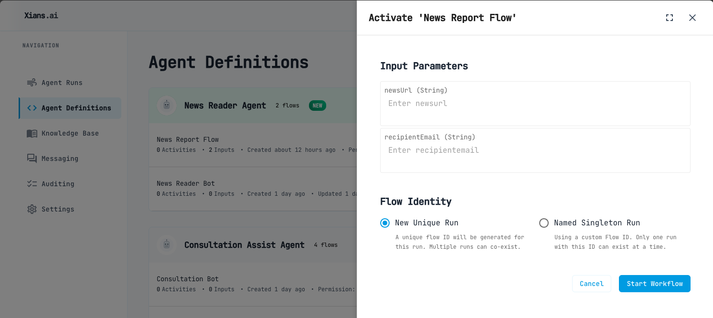
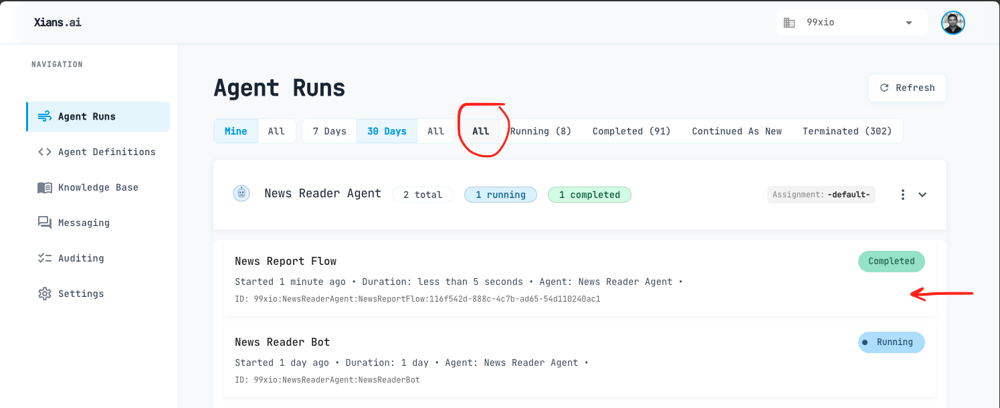

# Your First Business Process Flow (Deterministic)

AI agent could have a multiple workflows. Now we will add a new Flow which is a business process flow.

## What is a Deterministic Flow?

Deterministic flows follow a predefined path that executes the same way each time. With deterministic process orchestration, what happens during each process execution is determined ahead of time, usually through a business process model. Given the same inputs, configuration, environment, and conditions, the process will always follow the same sequence of steps and yield the same results.

Deterministic process orchestration offers several benefits:

- Predictability and reproducibility, making processes easy to audit
- Visual process models that help teams explain and collaborate on process design
- Self-documenting nature when using BPMN - what you see is exactly what will be executed
- Relatively low execution costs and typically fast performance

However, deterministic flows also present challenges:

- Require thorough understanding and agreement on business processes, which many organizations struggle with
- Process model creation takes time and requires testing
- Difficult to deliver highly personalized experiences without maintaining many model variations

If the business process is well-known and requires consistent, repeatable results, then a deterministic flow is an excellent choice.

## Intelligence at Activity Level

While maintaining the deterministic nature of the overall process flow, it's possible to incorporate AI intelligence at the individual activity level. This hybrid approach leverages the predictability of deterministic processes while enhancing specific activities with the reasoning capabilities of Large Language Models (LLMs).

For example:

- **Document processing**: An activity that needs to understand and extract information from emails, invoices, or contracts can use LLMs to intelligently parse unstructured content, even when formats vary.
- **Data analysis**: Activities requiring classification, summarization, or sentiment analysis can leverage LLMs to provide nuanced interpretations of text data.
- **Decision support**: When processes involve evaluating complex information (like candidate CVs or customer feedback), LLMs can assist by providing reasoned analysis while keeping the process flow itself deterministic.
- **Content enrichment**: Activities that need to enhance or transform content (such as product descriptions or knowledge base articles) can use LLMs to generate improvements.

The key advantage of this approach is that you retain the reliability, auditability, and predictable execution of deterministic workflows while gaining the cognitive capabilities of AI at critical points in your process. Process activities become intelligent nodes within your deterministic framework, capable of handling unstructured data and complex reasoning tasks without sacrificing the overall control and predictability of your business process.

## Creating a Business Process Flow

Update your Program.cs:
`Program.cs >`

```csharp
using XiansAi.Flow;
using DotNetEnv;

// Load the environment variables from the .env file
Env.Load();

// name your agent
var agent = new Agent("News Reader Agent");

var flow = agent.AddFlow<NewsReportFlow>();

var bot = agent.AddBot<NewsReaderBot>();
bot.AddCapabilities<Capabilities>();

await agent.RunAsync();
```

## Add the new business process flow

`NewsReportFlow.cs>`

```csharp
using Microsoft.Extensions.Logging;
using Temporalio.Workflows;
using XiansAi.Flow;

[Workflow("News Report Flow")]
public class NewsReportFlow : FlowBase
{
    [WorkflowRun]
    public async Task<string> Run(string newsUrl, string recipientEmail)
    {
      // TODO: Implement the news report flow

      // TODO: Send the news report to the recipient

      return "News report sent to " + recipientEmail;
    }
}

```

Notes:

- The Xians Flows are Temporal workflows. You can see more about the Temporal.io workflow engine [here](https://docs.temporal.io). You can simply use all the Temporal workflow features in your flows.

## Visualizing the Flow's Logic

Add the following in your .csproj file:

```xml
<Project Sdk="Microsoft.NET.Sdk">
...

  <ItemGroup>
    ...
    <!-- Embed the flow source files -->
    <EmbeddedResource Include="NewsReportFlow.cs">
        <LogicalName>%(Filename)%(Extension)</LogicalName>
    </EmbeddedResource>
  </ItemGroup>

</Project>

```

## Testing Your Setup

Run the application requesting to test the configuration:

```bash
dotnet run
```

Your agent will now be deployed to the Xians.ai platform. You should be able to Activate this flow from Xians.ai Manager portal.



Now under the `Runs` tab you should be able to see a completed run.



You can click on the run and see the details.

## Next Steps

- [Adding Activities](5-adding-activities.md)
