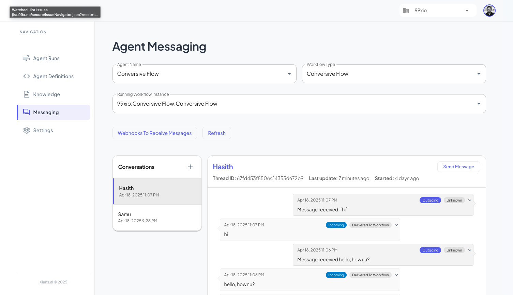

# Conversation with Agent

Xians AI provides a way to have a conversation with an agent. This is useful for when you want to have a conversation with an agent and get a response. Or even if the agent proactively sends a message to the user.

## Handling Conversations

To have a conversation with an agent, you can use the `Messenger` class variable in the `FlowBase` class.

```csharp
using Temporalio.Workflows;
using XiansAi.Flow;
using XiansAi.Messaging;

[Workflow("Conversive Flow")]
public class ConversiveAgentFlow: FlowBase
{
    private readonly Queue<MessageThread> _messageQueue = new Queue<MessageThread>();

    public ConversiveAgentFlow(): base()
    {
        // Register the message handler
        Messenger.RegisterHandler((MessageThread thread) => {
            _messageQueue.Enqueue(thread);
        });
    }

    [WorkflowRun]
    public async Task<string> Run()
    {

        while (true)
        {
            // Wait for a message to be added to the queue
            await Workflow.WaitConditionAsync(() => _messageQueue.Count > 0);

            // Get the message from the queue
            var thread = _messageQueue.Dequeue();
            var message = thread.IncomingMessage.Content;

            // TODO: Process the message

            // Respond to the message
            await thread.Respond($"Message received: `{message}`");

        }
    }
}

```

Steps to handle conversations:

1. Register a handler for the `MessageThread` event.
2. Queue the message
3. In WorkflowRun, wait for the queue to have a message
4. Dequeue the message
5. Process and respond to the message

## Testing Conversations

To test conversations, you can use the `Messaging` section in the Xians AI portal.



- select the agent you want to test
- select the workflow you want to test
- select the running instance you want to test (you need to have at least one running instance)
- create a new conversation by sending a message specifying `Participant ID` and `Content`
- Observe the response from the agent
