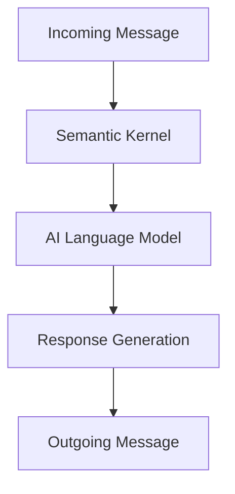
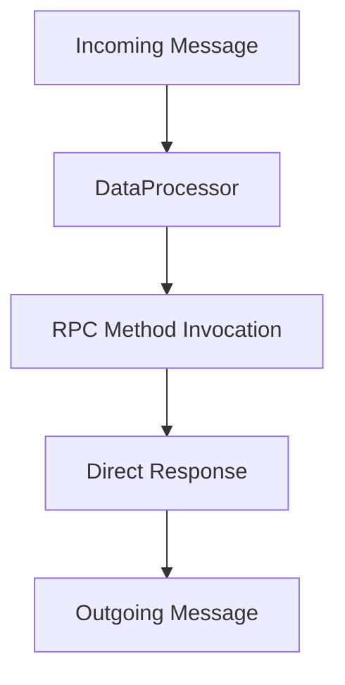

# Message Types

The Xians platform supports two primary message types for all communication scenarios (Agent2User, User2Agent, Agent2Agent): **Chat** and **Data**. While both types share the same data fields and structure, they differ fundamentally in how Agent workflows process them.

## Message Type Overview

| Type | Processing Method | Use Cases |
|------|------------------|-----------|
| **Chat** | Semantic Kernel + Natural Language | Conversations, Q&A, human-readable interactions |
| **Data** | DataProcessor RPC Methods | API integrations, structured data processing, automation |

## Common Message Structure

All messages share the same base structure regardless of type:

```json
{
  "id": "string",                    // Unique message identifier
  "createdAt": "string",             // ISO 8601 timestamp
  "direction": 1,                    // Message direction (0=incoming, 1=outgoing)
  "messageType": 1,                  // Message type (0=Chat, 1=Data)
  "text": "string",                   // Text content (optional)
  "data": {},                        // Structured data (optional)
  "hint": "string",                  // Processing hint (optional)
  "requestId": "string",             // Request correlation ID
  "participantId": "string",         // Participant identifier
  "workflowId": "string",            // Workflow instance ID
  "scope": "string"                  // Message scope (optional)
}
```

## Chat Messages

### Processing Method

Chat messages are processed through the **Semantic Kernel** as natural language queries. The Agent workflow interprets the text content using AI language models to understand intent and generate appropriate responses.

### Structure Example

```json
{
  "id": "msg-chat-123",
  "createdAt": "2024-01-15T10:30:00Z",
  "direction": 0,
  "messageType": 0,
  "text": "What is your return policy?",
  "participantId": "user-123",
  "workflowId": "customer-support-instance-1",
  "requestId": "req-456"
}
```

### API Request

```http
POST /api/user/rest/converse?workflow=Customer%20Support&type=Chat&participantId=user123&text=What%20are%20your%20business%20hours?
```

## Data Messages

### Processing Method

Data messages bypass the Semantic Kernel entirely and are processed through **DataProcessor classes** using RPC-style method invocation. The `text` field specifies the method name to invoke, while the request body contains the method parameters.

### Structure Example

```json
{
  "id": "msg-data-456",
  "createdAt": "2024-01-15T10:35:00Z",
  "direction": 0,
  "messageType": 1,
  "text": "ProcessDocumentRequest",
  "data": {
    "DocumentId": "contract-123",
    "ValidationType": "full"
  },
  "participantId": "system-api",
  "workflowId": "document-processor-instance-2",
  "requestId": "req-789"
}
```

### API Request

```http
POST /api/user/rest/converse?workflow=Document%20Processor&type=Data&participantId=system&text=ProcessDocumentRequest
Content-Type: application/json

{
  "DocumentId": "contract-123",
  "ValidationType": "comprehensive"
}
```

## Key Differences

### Processing Pipeline

**Chat Messages Flow:**



**Data Messages Flow:**



### Performance Characteristics

| Aspect | Chat Messages | Data Messages |
|--------|---------------|---------------|
| **Processing Speed** | Slower (AI processing) | Faster (direct method calls) |
| **Deterministic** | No (AI-generated responses) | Yes (programmatic logic) |
| **Resource Usage** | Higher (LLM inference) | Lower (direct execution) |
| **Scalability** | Limited by AI model capacity | Limited by system resources |

### Response Handling

**Chat Response:**

```json
{
  "response": {
    "text": "Our return policy allows returns within 30 days of purchase...",
    "data": null,
    "messageType": 0
  }
}
```

**Data Response:**

```json
{
  "response": {
    "text": null,
    "data": {
      "Contract": { "id": "contract-123", "status": "validated" },
      "Validations": [{"field": "signature", "status": "valid"}]
    },
    "messageType": 1
  }
}
```

## DataProcessor Implementation

For more details on Data message processing, see [Handling Data as RPC](./10-handling-data-rpc.md).


## TypeScript SDK

The TypeScript SDK provides a comprehensive set of tools for working with messages in the Xians platform. The SDK includes classes for creating, sending, and receiving messages, as well as utilities for working with message types and processing methods.

For more details on the TypeScript SDK message type handling, see [TypeScript SDK message Types](https://github.com/XiansAiPlatform/sdk-web-typescript/blob/main/docs/message-types.md).
