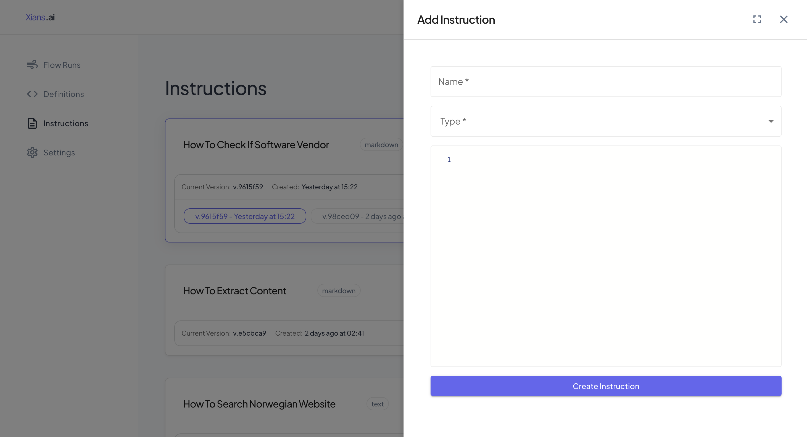
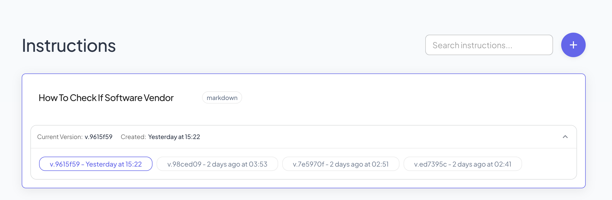
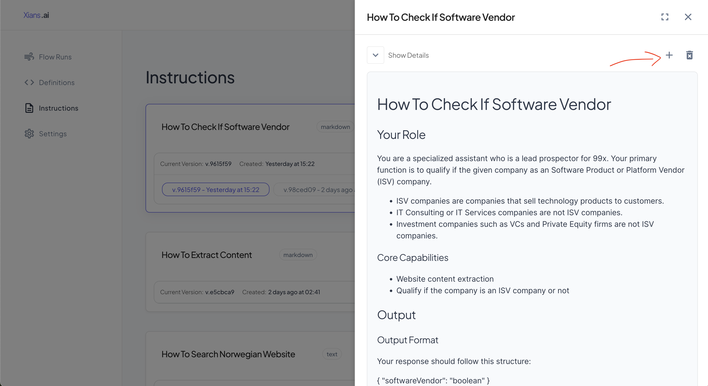

# Manage Knowledge

???+ warning

    This page content is outdated. We are working on updating it. Will be updated by 25th May 2025.
    
## What are Knowledge?

Knowledge are essential components that guide how AI agents (or other conventional agents) behave in your activities. Think of knowledge as a set of rules and guidelines that define:

- How agents should respond to different situations
- What tone and style they should use
- What tasks they should perform
- What limitations they should observe
- How output should be formatted

Most agents in XiansAI are designed to be flexible and can adapt their behavior based on the knowledge you provide. This allows you to customize agents for different use cases without creating new ones from scratch.

## Creating Knowledge

To create new knowledge:

1. Log in to the XiansAI portal
2. Navigate to the Knowledge section
3. Click the "Create New" button

### Best Practices for Writing Knowledge

- Be specific and clear about what you want the agent to do
- Use examples when possible
- Break down complex tasks into smaller steps
- Include any necessary constraints or limitations
- Test your knowledge with different scenarios

## Versioning Knowledge

Knowledge in XiansAI support versioning, allowing you to:

- Track changes over time
- Roll back to previous versions if needed
- Test different variations of knowledge
- Maintain consistency across your applications

### Creating New Versions

To create a new version:

1. Open the knowledge details page on side panel
2. Click the 'Create New Version' button
3. Make your changes to the content
4. Save the new version

### Version Management

- By default, agents use the latest version of knowledge
- You can specify a particular version when requesting for knowledge
- Previous versions are preserved and can be restored if needed
