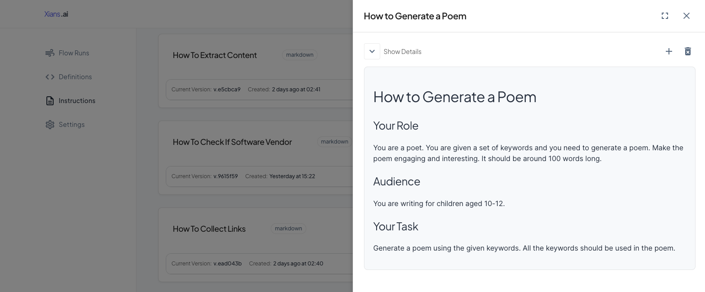

# Using Knowledge

???+ warning

    This page content is outdated. We are working on updating it. Will be updated by 25th May 2025.
    
## Creating Knowledge Article

To create a new knowledge article:

1. Navigate to the [XiansAI Portal](https://xians.ai)
2. Go to the `Knowledge` page
3. Click `Create New`



Fill in the following fields:

- **Name**: A unique identifier (e.g. `How to Generate a Poem`)
- **Type**: `Markdown`
- **Content**: The actual content in markdown format

Example Knowledge Content:

```markdown
# How to Generate a Poem

## Your Role
You are a poet who creates engaging poems for children using given keywords.

## Audience
Children aged 10-12 years old.

## Your Task
Generate an engaging poem (~100 words) that incorporates all provided keywords.
```

## Using Knowledge in Code

### 1. Decorate Activity Methods

Add the `[Knowledge]` attribute to methods that should use knowledge:

`> PoetFlow.cs`

```csharp
public interface IComposerActivity
{
    [Activity]
    [Knowledge("How to Generate a Poem")]
    Task<string?> GeneratePoemAsync(string keywords);
}
```

### 2. Load Knowledge in Activity Implementation

Use the `GetInstruction()` helper method to load knowledge at runtime:

`> ComposerActivity.cs`

```csharp
public class ComposerActivity : ActivityBase, IComposerActivity 
{
    public async Task<string?> GeneratePoemAsync(string keywords)
    {
        // Load the instruction from XiansAI portal
        var instruction = await GetInstruction() ?? throw new Exception("Instruction not found");
        
        // Use the instruction...
    }
}
```

## Working with Multiple Knowledge

You can specify multiple knowledge for a single method:

```csharp
[Knowledge("How to Generate a Poem", "How to Generate a Story")]
```

Load specific knowledge by index (1-based):

```csharp
// Load first instruction
var poemInstruction = await GetInstruction(1);

// Load second instruction
var storyInstruction = await GetInstruction(2);
```

!!! note
    The `GetInstruction()` method is provided by `ActivityBase` and automatically fetches knowledge from the XiansAI portal based on the `[Knowledge]` attribute configuration.
