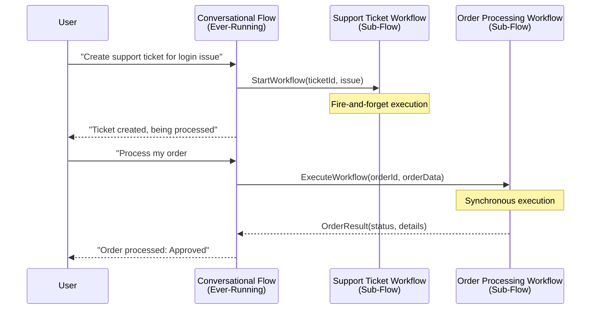
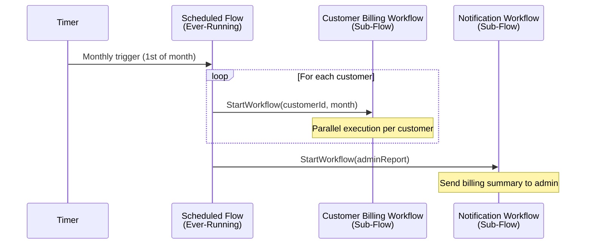
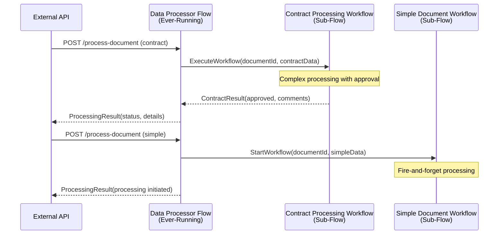

# Sub-Flows Created by Interface Flows

## Overview

The XiansAi platform enables any workflow to spawn new workflow instances using the `AgentContext.StartWorkflow` and `AgentContext.ExecuteWorkflow` methods. This powerful capability allows ever-running interface workflows (conversational, scheduled, or data processor flows) to create dedicated business process workflows that live for the duration of specific business transactions.

## Understanding the Pattern

### Ever-Running Interface Flows vs Process Workflows

The XiansAi platform follows a clear architectural pattern:

- **Interface Flows**: Long-running workflows that continuously listen for external triggers
  - Conversational flows that process user messages
  - Scheduled flows that execute on timers  
  - Data processor flows that handle API calls
- **Process (Sub) Workflows**: Short-lived workflows that execute specific business processes
  - Order processing workflows
  - Document approval workflows
  - Support ticket resolution workflows

### The Event Loop Pattern

Interface flows act as event loops that remain active indefinitely, waiting for triggers and spawning process workflows as needed. This creates a clear separation of concerns:

- Interface flows handle external communication and routing
- Process workflows handle business logic and state management

## Interface Flows and Sub-Flows in Practice

The following sequence diagrams illustrate how interface flows spawn sub-workflows in real-world scenarios:

### Conversational Flow Pattern



### Scheduled Flow Pattern



### Data Processor Flow Pattern



**Key Patterns:**
- **Interface Flows** remain running indefinitely, handling external triggers
- **StartWorkflow** creates fire-and-forget sub-flows for parallel processing
- **ExecuteWorkflow** creates sub-flows and waits for results before responding
- **Sub-flows** handle specific business processes with defined lifecycles

## AgentContext Methods

The `AgentContext` class provides two methods for creating sub-workflows:

### StartWorkflow Method

Starts a new workflow instance asynchronously without waiting for completion:

```csharp
public static async Task StartWorkflow<TWorkflow>(string namePostfix, object[] args)
```

**Parameters:**

- `TWorkflow`: The workflow class type to start
- `namePostfix`: A unique identifier appended to the workflow id
- `args`: Arguments to pass to the workflow's Run method

**Use Cases:**

- Fire-and-forget business processes
- Background processing that doesn't require a response
- Parallel workflow execution

### ExecuteWorkflow Method

Starts a new workflow instance and waits for its completion, returning a result:

```csharp
public static async Task<TResult> ExecuteWorkflow<TWorkflow, TResult>(string namePostfix, object[] args)
```

**Parameters:**

- `TWorkflow`: The workflow class type to execute
- `TResult`: The return type expected from the workflow
- `namePostfix`: A unique identifier appended to the workflow id  
- `args`: Arguments to pass to the workflow's Run method

**Use Cases:**

- Synchronous business processes that require a response
- Workflows that return processing results
- Sequential workflow dependencies

## Implementation Examples

### 1. Conversational Flow Spawning Process Workflows

Conversational flows can spawn dedicated workflows for complex business processes:

**Capability Implementation:**

```csharp
public class SupportCapabilities
{
    [Capability("Create a technical support ticket")]
    public async Task<string> CreateSupportTicket(string customerEmail, string issue)
    {
        // Spawn a dedicated support ticket workflow
        var ticketId = Guid.NewGuid().ToString();
        await AgentContext.StartWorkflow<SupportTicketWorkflow>(
            ticketId, 
            new object[] { customerEmail, issue, ticketId }
        );
        
        return $"Support ticket {ticketId} has been created and is being processed.";
    }
    
    [Capability("Process order with approval workflow")]
    public async Task<string> ProcessOrder(OrderRequest order)
    {
        // Execute order workflow and wait for result
        var result = await AgentContext.ExecuteWorkflow<OrderProcessingWorkflow, OrderResult>(
            order.OrderId,
            new object[] { order }
        );
        
        return $"Order {order.OrderId} processed. Status: {result.Status}";
    }
}
```

### 2. Scheduled Flow Spawning Process Workflows

Scheduled flows can create workflows for time-based business processes:

```csharp
[Workflow("Billing Agent:Scheduled Processor")]
public class BillingScheduledFlow : FlowBase
{
    [WorkflowRun]
    public async Task Run()
    {
        await InitSchedule();
    }
}

public class BillingProcessor
{
    [MonthlySchedule(1, "09:00")] // First day of month at 9 AM
    public async Task ProcessMonthlyBilling()
    {
        var customers = await GetActiveCustomers();
        
        foreach (var customer in customers)
        {
            // Start individual billing workflows for each customer
            await AgentContext.StartWorkflow<CustomerBillingWorkflow>(
                customer.Id,
                new object[] { customer.Id, DateTime.UtcNow.Month }
            );
        }
    }

}
```

### 3. Data Processor Flow Spawning Process Workflows

Data processor flows can spawn workflows based on external API calls:

```csharp
[Workflow("Document Processor:Main Flow")]
public class DocumentProcessorFlow : FlowBase
{
    [WorkflowRun]
    public async Task Run()
    {
        await InitDataProcessor();
    }
}

public class DocumentProcessor
{
    public async Task<ProcessingResult> ProcessDocument(DocumentRequest request)
    {
        // For complex documents, spawn a dedicated processing workflow
        if (request.DocumentType == "Contract")
        {
            var result = await AgentContext.ExecuteWorkflow<ContractProcessingWorkflow, ContractResult>(
                request.DocumentId,
                new object[] { request }
            );
            
            return new ProcessingResult 
            { 
                DocumentId = request.DocumentId,
                Status = result.IsApproved ? "Approved" : "Rejected",
                Details = result.ReviewComments
            };
        }
        
        // For simple documents, spawn fire-and-forget workflow
        await AgentContext.StartWorkflow<SimpleDocumentWorkflow>(
            request.DocumentId,
            new object[] { request }
        );
        
        return new ProcessingResult 
        { 
            DocumentId = request.DocumentId,
            Status = "Processing",
            Details = "Document processing initiated"
        };
    }
}
```

This sub-workflow pattern integrates seamlessly with the existing XiansAi flow types:

- **[Conversational Flows](../1-getting-started/2-first-agent.md)**: Use capabilities to spawn business process workflows
- **[Scheduled Flows](2-scheduled-execution.md)**: Use schedule processors to create time-based workflows  
- **[Data Processor Flows](1-external-triggers.md)**: Use data processors to spawn workflows from external API calls

By leveraging `AgentContext.StartWorkflow` and `AgentContext.ExecuteWorkflow`, any interface flow can become a powerful orchestrator of business processes, enabling complex automation scenarios while maintaining clean architectural boundaries.
