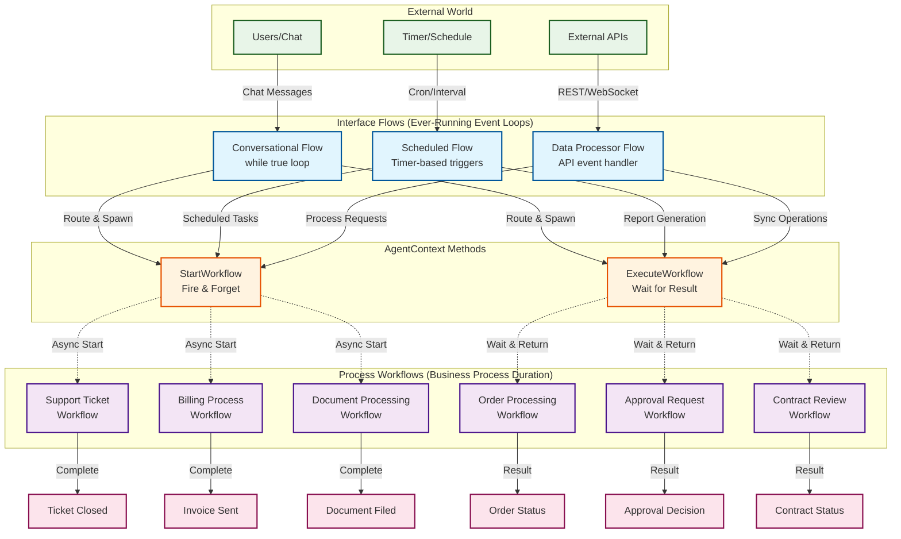

# Creating Sub-Flows with StartWorkflow and ExecuteWorkflow

## Overview

The XiansAi platform enables any workflow to spawn new workflow instances using the `AgentContext.StartWorkflow` and `AgentContext.ExecuteWorkflow` methods. This powerful capability allows ever-running interface workflows (conversational, scheduled, or data processor flows) to create dedicated business process workflows that live for the duration of specific business transactions.

## Understanding the Pattern

### Ever-Running Interface Flows vs Process Workflows

The XiansAi platform follows a clear architectural pattern:

- **Interface Flows**: Long-running workflows that continuously listen for external triggers
  - Conversational flows that process user messages
  - Scheduled flows that execute on timers  
  - Data processor flows that handle API calls
- **Process Workflows**: Short-lived workflows that execute specific business processes
  - Order processing workflows
  - Document approval workflows
  - Support ticket resolution workflows

### The Event Loop Pattern

Interface flows act as event loops that remain active indefinitely, waiting for triggers and spawning process workflows as needed. This creates a clear separation of concerns:

- Interface flows handle external communication and routing
- Process workflows handle business logic and state management

## AgentContext Methods

The `AgentContext` class provides two methods for creating sub-workflows:

### StartWorkflow Method

Starts a new workflow instance asynchronously without waiting for completion:

```csharp
public static async Task StartWorkflow<TWorkflow>(string namePostfix, object[] args)
```

**Parameters:**
- `TWorkflow`: The workflow class type to start
- `namePostfix`: A unique identifier appended to the workflow name
- `args`: Arguments to pass to the workflow's Run method

**Use Cases:**
- Fire-and-forget business processes
- Background processing that doesn't require a response
- Parallel workflow execution

### ExecuteWorkflow Method

Starts a new workflow instance and waits for its completion, returning a result:

```csharp
public static async Task<TResult> ExecuteWorkflow<TWorkflow, TResult>(string namePostfix, object[] args)
```

**Parameters:**
- `TWorkflow`: The workflow class type to execute
- `TResult`: The return type expected from the workflow
- `namePostfix`: A unique identifier appended to the workflow name  
- `args`: Arguments to pass to the workflow's Run method

**Use Cases:**
- Synchronous business processes that require a response
- Workflows that return processing results
- Sequential workflow dependencies

## Implementation Examples

### 1. Conversational Flow Spawning Process Workflows

Conversational flows can spawn dedicated workflows for complex business processes:

```csharp
[Workflow("Customer Support:Main Chat Bot")]
public class CustomerSupportBot : FlowBase
{
    private readonly Queue<MessageThread> _messageQueue = new Queue<MessageThread>();

    public CustomerSupportBot()
    {
        Messenger.RegisterHandler(_messageQueue.Enqueue);
    }

    [WorkflowRun]
    public async Task Run()
    {
        while (true)
        {
            await Workflow.WaitConditionAsync(() => _messageQueue.Count > 0);
            var thread = _messageQueue.Dequeue();
            
            // Process message asynchronously
            _ = ProcessMessage(thread);
        }
    }

    private async Task ProcessMessage(MessageThread thread)
    {
        var response = await Router.RouteAsync(thread, systemPrompt, capabilities);
        await thread.Respond(response);
    }
}
```

**Capability Implementation:**

```csharp
public class SupportCapabilities
{
    [Capability("Create a technical support ticket")]
    public async Task<string> CreateSupportTicket(string customerEmail, string issue)
    {
        // Spawn a dedicated support ticket workflow
        var ticketId = Guid.NewGuid().ToString();
        await AgentContext.StartWorkflow<SupportTicketWorkflow>(
            ticketId, 
            new object[] { customerEmail, issue, ticketId }
        );
        
        return $"Support ticket {ticketId} has been created and is being processed.";
    }
    
    [Capability("Process order with approval workflow")]
    public async Task<string> ProcessOrder(OrderRequest order)
    {
        // Execute order workflow and wait for result
        var result = await AgentContext.ExecuteWorkflow<OrderProcessingWorkflow, OrderResult>(
            order.OrderId,
            new object[] { order }
        );
        
        return $"Order {order.OrderId} processed. Status: {result.Status}";
    }
}
```

### 2. Scheduled Flow Spawning Process Workflows

Scheduled flows can create workflows for time-based business processes:

```csharp
[Workflow("Billing Agent:Scheduled Processor")]
public class BillingScheduledFlow : FlowBase
{
    [WorkflowRun]
    public async Task Run()
    {
        await InitSchedule();
    }
}

public class BillingProcessor
{
    [MonthlySchedule(1, "09:00")] // First day of month at 9 AM
    public async Task ProcessMonthlyBilling()
    {
        var customers = await GetActiveCustomers();
        
        foreach (var customer in customers)
        {
            // Start individual billing workflows for each customer
            await AgentContext.StartWorkflow<CustomerBillingWorkflow>(
                customer.Id,
                new object[] { customer.Id, DateTime.UtcNow.Month }
            );
        }
    }
    
    [DailySchedule("02:00")] // Daily at 2 AM
    public async Task ProcessDailyReports()
    {
        // Execute report workflow and get result
        var report = await AgentContext.ExecuteWorkflow<DailyReportWorkflow, ReportData>(
            DateTime.UtcNow.ToString("yyyyMMdd"),
            new object[] { DateTime.UtcNow.Date }
        );
        
        await SendReportToStakeholders(report);
    }
}
```

### 3. Data Processor Flow Spawning Process Workflows

Data processor flows can spawn workflows based on external API calls:

```csharp
[Workflow("Document Processor:Main Flow")]
public class DocumentProcessorFlow : FlowBase
{
    [WorkflowRun]
    public async Task Run()
    {
        await InitDataProcessor();
    }
}

public class DocumentProcessor
{
    public async Task<ProcessingResult> ProcessDocument(DocumentRequest request)
    {
        // For complex documents, spawn a dedicated processing workflow
        if (request.DocumentType == "Contract")
        {
            var result = await AgentContext.ExecuteWorkflow<ContractProcessingWorkflow, ContractResult>(
                request.DocumentId,
                new object[] { request }
            );
            
            return new ProcessingResult 
            { 
                DocumentId = request.DocumentId,
                Status = result.IsApproved ? "Approved" : "Rejected",
                Details = result.ReviewComments
            };
        }
        
        // For simple documents, spawn fire-and-forget workflow
        await AgentContext.StartWorkflow<SimpleDocumentWorkflow>(
            request.DocumentId,
            new object[] { request }
        );
        
        return new ProcessingResult 
        { 
            DocumentId = request.DocumentId,
            Status = "Processing",
            Details = "Document processing initiated"
        };
    }
}
```

## Process Workflow Examples

### Support Ticket Workflow
```csharp
[Workflow("Support Ticket Process")]
public class SupportTicketWorkflow : FlowBase
{
    [WorkflowRun]
    public async Task Run(string customerEmail, string issue, string ticketId)
    {
        // Create ticket record
        await Workflow.ExecuteActivityAsync(
            () => _activities.CreateTicketAsync(ticketId, customerEmail, issue)
        );
        
        // Assign to technician
        var technician = await Workflow.ExecuteActivityAsync(
            () => _activities.AssignTechnicianAsync(ticketId)
        );
        
        // Wait for resolution (with timeout)
        var resolved = await Workflow.WaitConditionAsync(
            () => IsTicketResolved(ticketId),
            TimeSpan.FromDays(7)
        );
        
        if (!resolved)
        {
            // Escalate if not resolved within SLA
            await Workflow.ExecuteActivityAsync(
                () => _activities.EscalateTicketAsync(ticketId)
            );
        }
        
        // Close ticket
        await Workflow.ExecuteActivityAsync(
            () => _activities.CloseTicketAsync(ticketId)
        );
    }
}
```

### Order Processing Workflow
```csharp
[Workflow("Order Processing")]
public class OrderProcessingWorkflow : FlowBase
{
    [WorkflowRun]
    public async Task<OrderResult> Run(OrderRequest order)
    {
        // Validate order
        var validation = await Workflow.ExecuteActivityAsync(
            () => _activities.ValidateOrderAsync(order)
        );
        
        if (!validation.IsValid)
        {
            return new OrderResult { Status = "Rejected", Reason = validation.ErrorMessage };
        }
        
        // Process payment
        var payment = await Workflow.ExecuteActivityAsync(
            () => _activities.ProcessPaymentAsync(order.PaymentInfo)
        );
        
        if (!payment.Success)
        {
            return new OrderResult { Status = "Payment Failed", Reason = payment.ErrorMessage };
        }
        
        // Reserve inventory
        await Workflow.ExecuteActivityAsync(
            () => _activities.ReserveInventoryAsync(order.Items)
        );
        
        // Schedule fulfillment
        await Workflow.ExecuteActivityAsync(
            () => _activities.ScheduleFulfillmentAsync(order.OrderId)
        );
        
        return new OrderResult { Status = "Approved", OrderId = order.OrderId };
    }
}
```

## Architecture Pattern Visualization

The following diagram illustrates how ever-running interface flows spawn dedicated process workflows:



### Pattern Benefits

This architectural pattern provides several key benefits:

1. **Separation of Concerns**: Interface flows handle external communication while process workflows focus on business logic
2. **Scalability**: Multiple process workflows can run concurrently without blocking interface flows
3. **Fault Tolerance**: Failed process workflows don't affect the interface flows' ability to handle new requests
4. **Resource Efficiency**: Process workflows consume resources only for their execution duration
5. **Maintainability**: Business processes can be modified independently of interface logic

## Workflow Naming and Identification

### Unique Workflow Names

The `namePostfix` parameter ensures each spawned workflow has a unique identifier:

```csharp
// Generate unique names for concurrent workflows
var ticketId = Guid.NewGuid().ToString();
await AgentContext.StartWorkflow<SupportTicketWorkflow>(ticketId, args);

var orderId = order.OrderId;
await AgentContext.ExecuteWorkflow<OrderWorkflow, OrderResult>(orderId, args);

var timestamp = DateTime.UtcNow.ToString("yyyyMMddHHmmss");
await AgentContext.StartWorkflow<ReportWorkflow>($"daily-{timestamp}", args);
```

### Workflow ID Generation

The platform automatically generates workflow IDs using the pattern:
```
{TenantId}:{WorkflowType}:{NamePostfix}
```

For example:
```
acme-corp:Order Processing:ORD-12345
acme-corp:Support Ticket:TKT-67890
acme-corp:Daily Report:daily-20241215093000
```

## Best Practices

### 1. Choose the Right Method

**Use StartWorkflow when:**
- The process doesn't need to return a result
- You want fire-and-forget behavior
- Multiple processes can run in parallel
- The calling workflow doesn't depend on completion

**Use ExecuteWorkflow when:**
- You need the process result
- The calling workflow must wait for completion
- You need synchronous behavior
- Error handling requires the result

### 2. Error Handling

```csharp
try
{
    var result = await AgentContext.ExecuteWorkflow<OrderWorkflow, OrderResult>(
        order.OrderId, 
        new object[] { order }
    );
    
    if (result.Status == "Failed")
    {
        // Handle business logic failure
        await NotifyCustomer(order.CustomerId, result.ErrorMessage);
    }
}
catch (WorkflowFailedException ex)
{
    // Handle workflow execution failure
    _logger.LogError(ex, "Order workflow failed for order {OrderId}", order.OrderId);
    throw;
}
```

### 3. Argument Passing

Pass arguments as an object array in the order expected by the workflow's Run method:

```csharp
// Workflow expects: Run(string orderId, OrderRequest order, CustomerInfo customer)
await AgentContext.StartWorkflow<OrderWorkflow>(
    order.OrderId,
    new object[] { order.OrderId, order, customer }
);
```

### 4. Resource Management

Consider the resource implications of spawned workflows:

```csharp
public class BulkProcessor
{
    private readonly SemaphoreSlim _semaphore = new SemaphoreSlim(10); // Limit concurrency
    
    public async Task ProcessBulkOrders(List<Order> orders)
    {
        var tasks = orders.Select(async order =>
        {
            await _semaphore.WaitAsync();
            try
            {
                await AgentContext.StartWorkflow<OrderWorkflow>(
                    order.OrderId, 
                    new object[] { order }
                );
            }
            finally
            {
                _semaphore.Release();
            }
        });
        
        await Task.WhenAll(tasks);
    }
}
```

## Common Use Cases

### 1. Customer Service Automation

```csharp
// Main conversation flow routes customer intents to specialized workflows
[Capability("Handle customer complaint")]
public async Task<string> HandleComplaint(string customerEmail, string complaint)
{
    var complaintId = Guid.NewGuid().ToString();
    
    // Start complaint resolution workflow
    await AgentContext.StartWorkflow<ComplaintResolutionWorkflow>(
        complaintId,
        new object[] { customerEmail, complaint, complaintId }
    );
    
    return $"Your complaint has been logged with ID {complaintId}. Our team will respond within 24 hours.";
}
```

### 2. Document Processing Pipeline

```csharp
// Data processor spawns workflows based on document type
public async Task<ProcessingResult> ProcessDocument(DocumentRequest request)
{
    switch (request.DocumentType)
    {
        case "Invoice":
            var invoiceResult = await AgentContext.ExecuteWorkflow<InvoiceProcessingWorkflow, InvoiceResult>(
                request.DocumentId,
                new object[] { request }
            );
            return MapToProcessingResult(invoiceResult);
            
        case "Contract":
            // Fire-and-forget for contracts (async review process)
            await AgentContext.StartWorkflow<ContractReviewWorkflow>(
                request.DocumentId,
                new object[] { request }
            );
            return new ProcessingResult { Status = "Under Review" };
            
        default:
            throw new ArgumentException($"Unsupported document type: {request.DocumentType}");
    }
}
```

### 3. Scheduled Business Processes

```csharp
public class MonthlyProcessor
{
    [MonthlySchedule(1, "02:00")] // First day of month at 2 AM
    public async Task ProcessMonthlyOperations()
    {
        // Start parallel monthly processes
        var billingTask = AgentContext.StartWorkflow<MonthlyBillingWorkflow>(
            DateTime.UtcNow.ToString("yyyyMM"),
            new object[] { DateTime.UtcNow.Month, DateTime.UtcNow.Year }
        );
        
        var reportTask = AgentContext.ExecuteWorkflow<MonthlyReportWorkflow, ReportData>(
            $"monthly-report-{DateTime.UtcNow:yyyyMM}",
            new object[] { DateTime.UtcNow.Month, DateTime.UtcNow.Year }
        );
        
        var inventoryTask = AgentContext.StartWorkflow<InventoryReconciliationWorkflow>(
            $"inventory-{DateTime.UtcNow:yyyyMM}",
            new object[] { DateTime.UtcNow.Month }
        );
        
        // Wait for report (needed for dashboard), others run async
        var report = await reportTask;
        await UpdateDashboard(report);
        
        // Wait for all to complete
        await billingTask;
        await inventoryTask;
    }
}
```

## Integration with Existing Flows

This sub-workflow pattern integrates seamlessly with the existing XiansAi flow types:

- **[Conversational Flows](../1-getting-started/2-first-agent.md)**: Use capabilities to spawn business process workflows
- **[Scheduled Flows](2-scheduled-execution.md)**: Use schedule processors to create time-based workflows  
- **[Data Processor Flows](1-external-triggers.md)**: Use data processors to spawn workflows from external API calls

By leveraging `AgentContext.StartWorkflow` and `AgentContext.ExecuteWorkflow`, any interface flow can become a powerful orchestrator of business processes, enabling complex automation scenarios while maintaining clean architectural boundaries.

