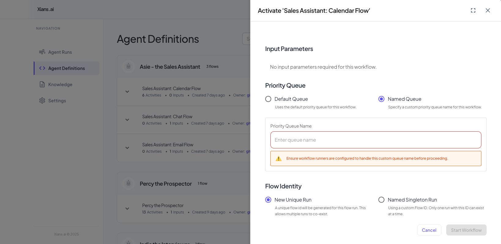

# Priority Queues

## Overview

Priority queues in Xians AI enable differentiated processing capabilities for different types of agent runs. This feature allows you to allocate more processing resources to specific queues, ensuring faster processing times for high-priority requests.

## Use Cases

### Subscription Tiers

Priority queues are particularly useful for implementing different subscription tiers, where customers can get different levels of service based on their subscription plan. For example:

- **Basic Tier**: Standard processing queue with normal wait times
- **Premium Tier**: High-priority queue with dedicated processing resources and reduced wait times

### Resource Allocation

By deploying more agent runner instances (containers) to handle high-priority queues, you can:

- Reduce wait times for premium customers
- Ensure critical workflows are processed faster
- Better manage system resources based on business priorities

## Configuration

### Setting Up Priority Queues in the Portal

1. Navigate to the XiansAI portal
2. Activate an Agent
3. At "Priority Queue" section, configure your queue name as needed



### Deploying Agents to Specific Queues

When deploying your agent, you can specify which queue it should process. The following example demonstrates how to configure an agent to use a specific priority queue:

```csharp
// read from commandline arguments of dotnet run
var commandLineArgs = Environment.GetCommandLineArgs();
var queue = commandLineArgs.Length > 1 ? commandLineArgs[1] : null;

// Create a new flow runner options
var options = new FlowRunnerOptions
{
    PriorityQueue = queue,
    LoggerFactory = loggerFactory,
};

try
{
    // Run the flow by passing the flow info to the FlowRunnerService
    await new FlowRunnerService(options).RunFlowAsync(flowInfo, tokenSource.Token);
}
catch (OperationCanceledException)
{
    Console.WriteLine("Application shutdown requested. Shutting down gracefully...");
}
```

```bash
dotnet run "premium"
```

## Best Practices

1. **Queue Naming**: Use clear, descriptive names for your queues (e.g., "premium", "standard")
2. **Resource Planning**: Monitor queue performance and adjust the number of agent runners accordingly
