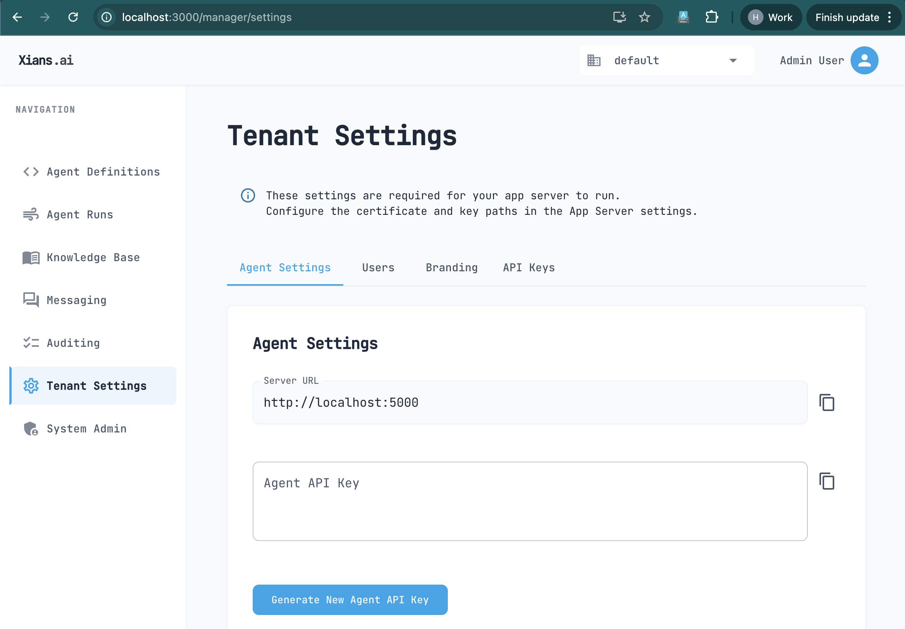

# Setting Up a Flow Project

## Prerequisites

- [.NET 9 SDK](https://dotnet.microsoft.com/en-us/download/dotnet/9.0)

## Creating a DotNet Project

Workflow Projects are Executable DotNet Projects that can be run locally and deployed to any server environment.

To create a new DotNet Console Project, you can use the following command:

```bash
dotnet new console -n MyNewXiansAiFlow
cd MyNewXiansAiFlow
```

## Adding the Xians.ai SDK

To add the Xians.ai SDK to your project, you can use the following command:

```bash
dotnet add package XiansAi.Lib
```

!!! note "Expert Tip"
    If you are using locally cloned XiansAi.Lib repository, add a Project Reference instead of the Nuget Package. E.g.,
    ```xml
    <ItemGroup>
        <ProjectReference Include="..\XiansAi.Lib\XiansAi.Lib.csproj" />
    </ItemGroup>
    ```

## Create a new flow

You will create a new flow and the necessary activities that will be used in the flow. These flows will run your local machine while development, and you may deploy to any server environment.

XiansAi.Lib is the library that connects your flow with the XiansAI platform. There are 2 parts in the XiansAi platform:

1. App Server: This is the server that allows you to manage your flows and instructions. It provides visibility into the flow execution and allows you to manage your flows and instructions.
2. Flow Server: This is the server that will run your flow. It is the server that will be deployed to the XiansAI platform.

Next we will download the necessary certificates to configure the Flow Runner.

## Download Necessary Certificates

To create a new flow, we need a create a `FlowRunnerService` instance and provide it with the 'flow' and 'activity' classes.

To configure the `FlowRunnerService` with XiansAi platform, add the following code to your `Program.cs`.

`Program.cs >`

```csharp
using XiansAi.Flow;

Environment.SetEnvironmentVariable("APP_SERVER_URL", "https://xiansai-server.azurewebsites.net");
Environment.SetEnvironmentVariable("APP_SERVER_CERT_PATH", "./certs/AppServerCert-1736843478734.pfx");
Environment.SetEnvironmentVariable("APP_SERVER_CERT_PWD", "my-password");
Environment.SetEnvironmentVariable("FLOW_SERVER_URL", "tenant-99x.ozqzb.tmprl.cloud:7233");
Environment.SetEnvironmentVariable("FLOW_SERVER_NAMESPACE", "tenant-99x.ozqzb");
Environment.SetEnvironmentVariable("FLOW_SERVER_CERT_PATH", "./certs/FlowServerCert-1736843586061.crt");
Environment.SetEnvironmentVariable("FLOW_SERVER_PRIVATE_KEY_PATH", "./certs/FlowServerPrivateKey-1736843587832.key");

var flowRunner = new FlowRunnerService(config);

// Register the flow (see the next section for more details)
```

You can find the settings required to run the `FlowRunnerService` on the XiansAi portal's `Settings` section.



Example `Config` object:

```csharp
var config = new PlatformConfig {
    AppServerUrl = "https://xiansai-server.azurewebsites.net ", 
    AppServerCertPath = "./certs/AppServerCert-1736843478734.pfx", 
    AppServerCertPwd = "my-password", 
    FlowServerUrl = "tenant-99x.ozqzb.tmprl.cloud:7233", 
    FlowServerNamespace = "tenant-99x.ozqzb", 
    FlowServerCertPath = "./certs/FlowServerCert-1736843586061.crt", 
    FlowServerPrivateKeyPath = "FlowServerPrivateKey-1736843587832.key" 
};
```

Use the values from the XiansAI portal to configure the `Config` object. Set the local path to the certificate files you downloaded from the XiansAI portal.

!!! note "Expert Tip"
    You can use DotNetEnv package to load the environment variables from the `.env` file without hardcoding them in your code.

## Validate the configuration

To validate the configuration, lets temporarily call `TestMe()` method from the `FlowRunnerService` instance.

```csharp
...
var flowRunner = new FlowRunnerService(config);
flowRunner.TestMe(); // temp method to validate the configuration
```

Now run the following command:

```bash
dotnet run
```

If you do not get errors, your configuration is correct. You can now remove the test call to `TestMe()` method in your code.

## Next Steps

Now that you have set up your environment, you can proceed to [create your first flow](2-first-flow.md).
