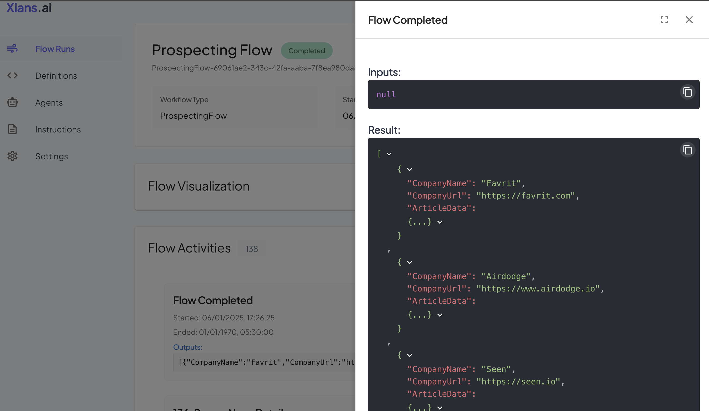

# Your First Flow

## Creating a Flow

You can create a new flow by creating a new class that inherits from `XiansAi.Flow.FlowBase`. This is the simplest way to create a flow. if you want to create a more complex flows that uses `Instructions` or `Docker Agent`, you can use different base classes as we will see in the next sections.

`SimpleFlow.cs >`

```csharp
using Temporalio.Workflows;
using XiansAi.Flow;

[Workflow]
public class SimpleFlow: FlowBase
{
    [WorkflowRun]
    public async Task<string> Run()
    {
        var resultOne = await RunActivityAsync( (ActivityOne a) => a.DoFirstThing());
        var resultTwo = await RunActivityAsync( (ActivityTwo a) => a.DoSecondThing());
        return $"{resultOne} - {resultTwo}";
    }
}
```

## Create the Activities

Activities are the building blocks of a flow. They are the smallest unit of work that can be executed by a flow. You can create a new activity by creating a new class that implements an interface. 

- The activity class must inherit from `XiansAi.Activity.ActivityBase`.
- The `[Activity]` attribute is used to mark the method as an activity on both the interface and the class.
- The `[Activity]` method must be async.
- The activity class must have a `[Activity]` attribute.

`ActivityOne.cs >`

```csharp
using Temporalio.Activities;
using XiansAi.Activity;

public interface IActivityOne
{
    [Activity]
    Task<string> DoFirstThing();
}

public class ActivityOne : ActivityBase,  IActivityOne
{
    [Activity]
    public async Task<string> DoFirstThing()
    {
        await Task.Delay(1000);
        return "Activity One";
    }
}
```

`ActivityTwo.cs >`

```csharp

using Temporalio.Activities;
using XiansAi.Activity;

public interface IActivityTwo
{
    [Activity]
    Task<string> DoSecondThing();
}

public class ActivityTwo : ActivityBase, IActivityTwo
{
    [Activity]
    public async Task<string> DoSecondThing()
    {
        await Task.Delay(1000);
        return "Activity Two";
    }
}
```

## Registering the Flow

To register the flow, you need to add the new flow to Flow Runner on your `Program.cs` file. Update the `Program.cs` file with the following code:

`Program.cs >`

```csharp
using XiansAi.Flow;

// TODO: Get these values from the XiansAI portal
var config = ...

// Runner for the flow
var flowRunner = new FlowRunnerService(config);

// Define the flow
var flowInfo = new FlowInfo<SimpleFlow>();

// Add activities to the flow
flowInfo.AddActivity<IActivityOne>(new ActivityOne());
flowInfo.AddActivity<IActivityTwo>(new ActivityTwo());

// Run the flow
Task simpleFlowTask = flowRunner.RunFlowAsync(flowInfo, CancellationToken.None);

// Wait for the flow to complete
await simpleFlowTask;


```

## Configuring flow visualization

You need to configure bundling the source code of the flow file into the assembly. This is done by adding the following to your `csproj` file:

```xml
  <ItemGroup>
    <!-- Embed the flow source files -->
    <EmbeddedResource Include="SimpleFlow.cs">
        <!-- Keep the resource name simple since files are in root -->
        <LogicalName>%(Filename)%(Extension)</LogicalName>
    </EmbeddedResource>
  </ItemGroup>
```

It is recommended to keep the flow files on the root of the project.

## Running the Flow

To run the flow, you can run the following command:

```bash
dotnet build    
dotnet run
```

Program now waits to run the flows you are starting. You can start a new flow on the XiansAI portal by visiting the 'Flow Definitions' section and clicking on the 'Start New' button of your new flow Type (SimpleFlow).


## Monitoring the Flow

You can monitor the flow by visiting the 'Flow Runs' section of the XiansAI portal.


You can see the flow run details by clicking on the flow run id. For activities, you are able to see details such as:

- Activity Inputs
- Activity Outputs
- Activity Start Time
- Activity End Time
- Activity Instructions
- Activity Agents


