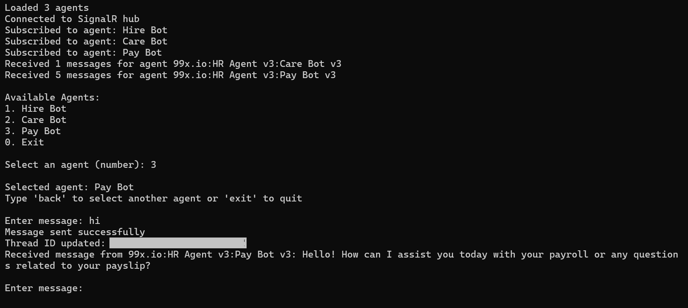

# Accessing Agents Through WebSocket Connection

This guide demonstrates how to create a .NET console application that connects to XiansAI agents using SignalR WebSocket connections.

## Prerequisites

- .NET 8.0 or later
- Microsoft.AspNetCore.SignalR.Client NuGet package
- Newtonsoft.Json NuGet package
- DotNetEnv NuGet package

## Project Setup

1. Create a new .NET console application:
```bash
dotnet new console -n AgentChatClient
cd AgentChatClient
```

2. Add required NuGet packages:
```bash
dotnet add package Microsoft.AspNetCore.SignalR.Client
dotnet add package Newtonsoft.Json
dotnet add package DotNetEnv
```

3. Create a `.env` file in your project directory:
```env
WEBSOCKET_URL=https://your-hub-url/ws/chat
API_KEY=your-api-key
TENANT_ID=your-tenant-id
PARTICIPANT_ID=your-participant-id
```
The api-key can be generated from the Xians portal. Navigate to Settings > API Keys tab > Create API Key. 

## Setup Websocket Connection

Before subscribing to agents, you need to establish a websocket connection. Here's how to set up and start the connection:

```csharp
private static async Task SetupWebsocketConnection()
{
    // Create the connection with authentication
    _connection = new HubConnectionBuilder()
        .WithUrl($"{_webSocketUrl}?tenantId={_tenantId}", options =>
        {
            options.Headers.Add("Authorization", $"Bearer {_apiKey}");
        })
        .WithAutomaticReconnect()  // Enable automatic reconnection
        .Build();

    try
    {
        // Start the connection
        await _connection.StartAsync();
        Console.WriteLine("Connected to Websocket hub");
    }
    catch (Exception ex)
    {
        Console.WriteLine($"Error connecting to Websocket hub: {ex.Message}");
        throw;
    }
}
```

Important notes:
- The connection requires a valid WebSocket URL, API key, and tenant ID
- The connection includes automatic reconnection capability
- Message handlers should be set up before starting the connection
- Always handle connection errors appropriately
- The connection must be established before attempting to subscribe to agents

## Agent Configuration

1. Create an `agents.json` file in your project directory with the following structure:
```json
[
    {
        "id": "tenant:agent-name:workflow-name",
        "name": "bot-name",
        "agent": "agent-name",
        "workflowType": "workflow-type"
    }
]
```

2. Use the following model to represent agent configuration:
```csharp
public class AgentConfig
{
    public string Id { get; set; }           // Unique identifier for the agent
    public string Name { get; set; }         // Display name of the agent
    public string Agent { get; set; }        // Agent identifier
    public string WorkflowType { get; set; } // Type of workflow the agent handles
}
```

Required parameters:
- `id`: Unique identifier in format "tenant:agent-name:workflow-name, also refered to workflowId"
- `name`: Display name for the agent
- `agent`: Agent identifier
- `workflowType`: Type of workflow the agent handles

### Subscribing to Agents

To subscribe to agents, you need to call the `SubscribeToAgent` method through the Websocket connection. This establishes a connection between your client and the specified agent.

```csharp
// Example of subscribing to an agent
await connection.InvokeAsync("SubscribeToAgent", 
    agentId,        // The agent's unique identifier
    participantId,  // Your participant ID
    tenantId        // Your tenant ID
);
```

Here's a complete example of subscribing to multiple agents:

```csharp
private static async Task SubscribeToAgents()
{
    foreach (var agent in _agents)
    {
        try
        {
            await _connection.InvokeAsync("SubscribeToAgent", 
                agent.Id, 
                _participantId, 
                _tenantId);
            Console.WriteLine($"Subscribed to agent: {agent.Name}");
        }
        catch (Exception ex)
        {
            Console.WriteLine($"Error subscribing to agent {agent.Name}: {ex.Message}");
        }
    }
}
```

Important notes:
- Make sure you have established the Websocket connection before subscribing
- Each agent needs to be subscribed individually
- The subscription is required to receive messages from the agent
- If the subscription fails, you won't be able to communicate with that agent

## Message Flow

The message history is received through the Websocket connection in the following way:

### 1. Initial History Load

   - When the application starts, it calls `GetThreadHistory` for each agent
   - This request is made through the Websocket connection
   - Parameters required:
     ```csharp
     await connection.InvokeAsync("GetThreadHistory",
         1,                  // Page number
         20                  // Page size
     );
     ```

### 2. History Reception

   - The server responds with a `ThreadHistory` event
   - This event contains a list of messages for the specified agent
   - Messages are received in the `HandleThreadHistory` method:
     ```csharp
     _connection.On<List<Message>>("ThreadHistory", HandleThreadHistory);
     ```

### 3. Message Structure

   Use the following model to represent a Message. Each message in the history contains:
   ```csharp
   public class Message
   {
       public string Content { get; set; }      // Message content
       public string Direction { get; set; }    // Message direction (Incoming/Outgoing)
       public DateTime CreatedAt { get; set; }  // Message creation timestamp
       public string WorkflowId { get; set; }   // Agent workflow ID
       public string ThreadId { get; set; }     // Conversation thread ID
       public string ParticipantId { get; set; }// Participant ID
       public object Metadata { get; set; }     // Additional metadata
   }
   ```

### 4. Message Sending and Receiving

   - Messages are sent using the Websocket connection's `SendInboundMessage` method
   - The application waits for a response before continuing
   - When sending messages, use the following request model:
   ```csharp
   public class SendMessageRequest
   {
       public string ThreadId { get; set; }      // Conversation thread ID
       public string Agent { get; set; }         // Agent identifier
       public string WorkflowType { get; set; }  // Type of workflow
       public string WorkflowId { get; set; }    // Workflow ID
       public string ParticipantId { get; set; } // Participant ID
       public string Content { get; set; }       // Message content
       public object Metadata { get; set; }      // Additional metadata
   }
   ```

   Example code for sending and receiving messages:
   ```csharp
   // Setup message handler
   _connection.On<Message>("ReceiveMessage", message => {
       Console.WriteLine($"Received: {message.Content}");
       _messageResponseReceived?.TrySetResult(true);
   });

   // Send a message
   async Task SendMessage(string currentThreadId, string content, string agentName, string workflowType, string WorkflowId, string participantId )
   {
       var request = new SendMessageRequest
       {
           ThreadId = currentThreadId,
           Agent = agentName,
           WorkflowType = workflowType,
           WorkflowId = WorkflowId,
           ParticipantId = participantId,
           Content = content,
           Metadata = null
       };

       try
       {
           // Create a new TaskCompletionSource for this message
           _messageResponseReceived = new TaskCompletionSource<bool>();
           
           // Send the message
           await _connection.InvokeAsync("SendInboundMessage", request);
           Console.WriteLine("Message sent successfully");
           
           // Wait for response (30 second timeout)
           using var cts = new CancellationTokenSource(TimeSpan.FromSeconds(30));
           await _messageResponseReceived.Task.WaitAsync(cts.Token);
       }
       catch (OperationCanceledException)
       {
           Console.WriteLine("No response received within 30 seconds");
       }
   }

   // Usage example
   await SendMessage("Hello, how are you?", "my-agent-name");
   ```

### 5. History Storage

   - Messages are stored in the `_chatHistories` dictionary
   - Key: Agent's WorkflowId
   - Value: List of messages for that agent
   ```csharp
   private static Dictionary<string, List<Message>> _chatHistories;
   ```

### 6. Pagination

   - History is loaded in pages of 20 messages
   - More messages can be loaded by incrementing the page number

### 7. Real-time Updates

   - New messages are received through the `ReceiveMessage` event
   - Make sure the Messages are automatically added to the chat history
   - Make sure the history is maintained in chronological order

## Implementation

### 1. Main Program Implementation

```csharp
using Microsoft.AspNetCore.SignalR.Client;
using Newtonsoft.Json;

class Program
{
    private static HubConnection _connection;
    private static List<AgentConfig> _agents;
    private static Dictionary<string, List<Message>> _chatHistories;
    private static string _currentThreadId;
    private static string _selectedAgentId;
    private static TaskCompletionSource<bool> _messageResponseReceived;

    // Global configuration variables
    private static string _webSocketUrl;
    private static string _apiKey;
    private static string _tenantId;
    private static string _participantId;

    static async Task Main(string[] args)
    {
        // Load environment variables
        DotNetEnv.Env.Load();
        
        // Initialize configuration
        _webSocketUrl = Environment.GetEnvironmentVariable("WEBSOCKET_URL") 
            ?? throw new InvalidOperationException("WEBSOCKET_URL is not configured");
        _apiKey = Environment.GetEnvironmentVariable("API_KEY") 
            ?? throw new InvalidOperationException("API_KEY is not configured");
        _tenantId = Environment.GetEnvironmentVariable("TENANT_ID") 
            ?? throw new InvalidOperationException("TENANT_ID is not configured");
        _participantId = Environment.GetEnvironmentVariable("PARTICIPANT_ID") 
            ?? throw new InvalidOperationException("PARTICIPANT_ID is not configured");
        
        _chatHistories = new Dictionary<string, List<Message>>();
        
        // Load agent configurations
        await LoadAgentConfigurations();
        
        // Setup SignalR connection
        await SetupWebsocketConnection();
        
        // Subscribe to agents
        await SubscribeToAgents();
        
        // Load initial chat history
        await LoadInitialChatHistory();
        
        // Start message loop
        await StartMessageLoop();
    }

    private static async Task LoadAgentConfigurations()
    {
        try
        {
            string json = await File.ReadAllTextAsync("<agents.json File Path>");
            _agents = JsonConvert.DeserializeObject<List<AgentConfig>>(json);
            Console.WriteLine($"Loaded {_agents.Count} agents");
        }
        catch (Exception ex)
        {
            Console.WriteLine($"Error loading agent configurations: {ex.Message}");
            throw;
        }
    }

    private static async Task SetupWebsocketConnection()
    {
        _connection = new HubConnectionBuilder()
            .WithUrl($"{_webSocketUrl}?tenantId={_tenantId}", options =>
            {
                options.Headers.Add("Authorization", $"Bearer {_apiKey}");
            })
            .WithAutomaticReconnect()
            .Build();

        // Setup message handlers
        _connection.On<Message>("ReceiveMessage", HandleReceivedMessage);
        _connection.On<string>("InboundProcessed", HandleInboundProcessed);
        _connection.On<List<Message>>("ThreadHistory", HandleThreadHistory);

        try
        {
            await _connection.StartAsync();
            Console.WriteLine("Connected to Websocket hub");
        }
        catch (Exception ex)
        {
            Console.WriteLine($"Error connecting to Websocket hub: {ex.Message}");
            throw;
        }
    }

    private static async Task SubscribeToAgents()
    {
        foreach (var agent in _agents)
        {
            try
            {
                await _connection.InvokeAsync("SubscribeToAgent", 
                    agent.Id, 
                    _participantId, 
                    _tenantId);
                Console.WriteLine($"Subscribed to agent: {agent.Name}");
            }
            catch (Exception ex)
            {
                Console.WriteLine($"Error subscribing to agent {agent.Name}: {ex.Message}");
            }
        }
    }

    private static async Task LoadInitialChatHistory()
    {
        foreach (var agent in _agents)
        {
            try
            {
                await _connection.InvokeAsync("GetThreadHistory", 1, 20);
            }
            catch (Exception ex)
            {
                Console.WriteLine($"Error loading history for agent {agent.Name}: {ex.Message}");
            }
        }
    }

    private static void HandleReceivedMessage(Message message)
    {
        Console.WriteLine($"Received message from {message.WorkflowId}: {message.Content}");
        
        if (!_chatHistories.ContainsKey(message.WorkflowId))
        {
            _chatHistories[message.WorkflowId] = new List<Message>();
        }
        
        _chatHistories[message.WorkflowId].Add(message);

        // Signal that we've received a response
        _messageResponseReceived?.TrySetResult(true);
    }

    private static void HandleInboundProcessed(string threadId)
    {
        _currentThreadId = threadId;
        Console.WriteLine($"Thread ID updated: {threadId}");
    }

    private static void HandleThreadHistory(List<Message> history)
    {
        if (history == null || !history.Any()) return;

        string agentId = history[0].WorkflowId;
        Console.WriteLine($"Received {history.Count} messages for agent {agentId}");

        if (!_chatHistories.ContainsKey(agentId))
        {
            _chatHistories[agentId] = new List<Message>();
        }

        _chatHistories[agentId].AddRange(history);
    }

    private static async Task StartMessageLoop()
    {
        while (true)
        {
            // Display available agents
            Console.WriteLine("\nAvailable Agents:");
            for (int i = 0; i < _agents.Count; i++)
            {
                Console.WriteLine($"{i + 1}. {_agents[i].Name}");
            }
            Console.WriteLine("0. Exit");

            // Get agent selection
            Console.Write("\nSelect an agent (number): ");
            string selection = Console.ReadLine();

            if (selection == "0")
                break;

            if (!int.TryParse(selection, out int agentIndex) || 
                agentIndex < 1 || 
                agentIndex > _agents.Count)
            {
                Console.WriteLine("Invalid selection. Please try again.");
                continue;
            }

            // Set selected agent
            _selectedAgentId = _agents[agentIndex - 1].Id;
            Console.WriteLine($"\nSelected agent: {_agents[agentIndex - 1].Name}");
            Console.WriteLine("Type 'back' to select another agent or 'exit' to quit");

            // Message input loop for selected agent
            while (true)
            {
                Console.Write("\nEnter message: ");
                string input = Console.ReadLine();

                if (input?.ToLower() == "exit")
                    return;

                if (input?.ToLower() == "back")
                    break;

                if (string.IsNullOrEmpty(input))
                    continue;

                var selectedAgent = _agents.FirstOrDefault(a => a.Id == _selectedAgentId);
                if (selectedAgent == null)
                    continue;

                var request = new SendMessageRequest
                {
                    ThreadId = _currentThreadId,
                    Agent = selectedAgent.Agent,
                    WorkflowType = selectedAgent.WorkflowType,
                    WorkflowId = selectedAgent.Id,
                    ParticipantId = _participantId,
                    Content = input,
                    Metadata = null
                };

                try
                {
                    // Create a new TaskCompletionSource for this message
                    _messageResponseReceived = new TaskCompletionSource<bool>();
                    
                    // Send the message
                    await _connection.InvokeAsync("SendInboundMessage", request);
                    Console.WriteLine("Message sent successfully");
                    
                    // Wait for the response with a timeout
                    using var cts = new CancellationTokenSource(TimeSpan.FromSeconds(30));
                    try
                    {
                        await _messageResponseReceived.Task.WaitAsync(cts.Token);
                    }
                    catch (OperationCanceledException)
                    {
                        Console.WriteLine("No response received within 30 seconds");
                    }
                }
                catch (Exception ex)
                {
                    Console.WriteLine($"Error sending message: {ex.Message}");
                }
            }
        }
    }
}
```

## Usage

### 1. Run the Application

```bash
dotnet run
```
### 2. Console Application



## Key Features

### 1. Connection Management
   - Automatic reconnection
   - API key authentication
   - Tenant ID support

### 2. Message Handling
   - Real-time message reception
   - Message history loading
   - Thread ID tracking

### 3. Agent Management
   - Multiple agent support
   - Agent subscription
   - Separate chat histories

## Troubleshooting

Common issues and solutions:

### 1. Connection Issues
   - Verify API key and tenant ID in .env file
   - Check network connectivity
   - Ensure hub URL is correct

### 2. Message Delivery Issues
   - Verify agent configuration
   - Check message format
   - Validate thread ID

### 3. History Loading Issues
   - Verify agent subscription
   - Check pagination parameters
   - Validate agent IDs
