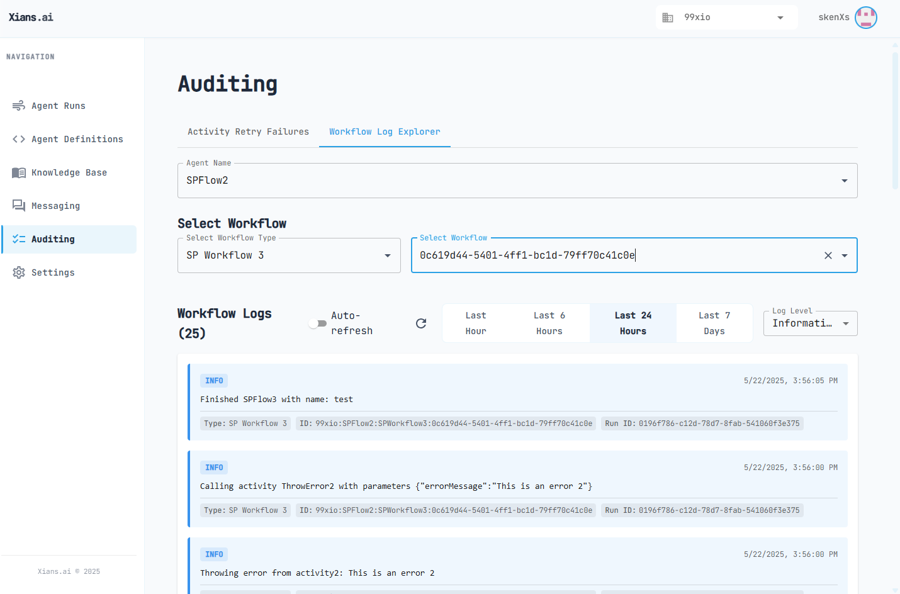

# Logging in Agent Flows

This guide explains how to implement logging in your XiansAi workflows using the built-in logging framework.

## Overview

XiansAi provides a robust logging system built on top of Microsoft.Extensions.Logging that integrates with Temporal workflows. The system supports multiple log levels, context-aware logging, and configurable output destinations. This approach enables:

- Consistent logging across workflows and activities
- Automatic context capture for better debugging
- Configurable log levels for different environments
- Thread-safe logging implementation

## Step 1: Initialize Logger

To use logging in your workflow or activity, first initialize a static logger instance:

```csharp
using Agentri.Logging;

public class YourWorkflow : FlowBase
{
    private static readonly Logger<YourWorkflow> _logger = Logger<YourWorkflow>.For();
}
```

## Step 2: Configure Logging

The logging system can be configured through environment variables:

```bash
# Set console log level (defaults to Debug if not set)
CONSOLE_LOG_LEVEL=DEBUG  # Options: TRACE, DEBUG, INFORMATION/INFO, WARNING/WARN, ERROR, CRITICAL

# Set API log level for database logging (defaults to Error if not set)
API_LOG_LEVEL=ERROR      # Options: TRACE, DEBUG, INFORMATION/INFO, WARNING/WARN, ERROR, CRITICAL
```

### Console vs API Logging

It's important to understand the distinction between console logging and API logging:

- **`CONSOLE_LOG_LEVEL`**: Controls which logs are displayed in the agent's console output. This is useful for local debugging and monitoring agent activity in real-time.

- **`API_LOG_LEVEL`**: Controls which logs are sent to the server and stored in the database. By default, only logs with level `ERROR` and above are sent to the server for database storage.

The API log level supports the following values:
- `TRACE`: All log levels are sent to the database
- `DEBUG`: Debug and above are sent to the database  
- `INFORMATION` or `INFO`: Information and above are sent to the database
- `WARNING` or `WARN`: Warning and above are sent to the database
- `ERROR`: Only Error and Critical logs are sent to the database (default)
- `CRITICAL`: Only Critical logs are sent to the database

### Database Log Retention

Logs stored in the database have a **Time-To-Live (TTL) of 15 days**. After this period, logs are automatically deleted from the database to manage storage efficiently. This retention policy ensures that recent logs are available for debugging and auditing while preventing unlimited storage growth.

## Step 3: Implement Logging

### Workflow Example

```csharp
using Temporalio.Workflows;
using Agentri.Flow;
using Agentri.Logging;

[Workflow("Example Workflow")]
public class ExampleWorkflow : FlowBase
{
    private static readonly Logger<ExampleWorkflow> _logger = Logger<ExampleWorkflow>.For();

    private readonly ActivityOptions _activityOptions = new()
    {
        ScheduleToCloseTimeout = TimeSpan.FromMinutes(1)
    };

    [WorkflowRun]
    public async Task<string> Run(string input)
    {
        _logger.LogInformation("Starting workflow with input: " + input);

        try
        {
            var result = await Workflow.ExecuteActivityAsync(
                (IExampleActivity a) => a.ProcessData(input), 
                _activityOptions
            );

            _logger.LogInformation("Workflow completed successfully");
            return result;
        }
        catch (Exception ex)
        {
            _logger.LogCritical("Critical workflow failure that requires admin attention", ex);
            throw;
        }
    }
}
```

### Activity Example

```csharp
using Temporalio.Activities;
using Agentri.Logging;

public interface IExampleActivity
{
    [Activity]
    Task<string> ProcessData(string input);
}

public class ExampleActivity : IExampleActivity
{
    private static readonly Logger<ExampleActivity> _logger = Logger<ExampleActivity>.For();

    public Task<string> ProcessData(string input)
    {
        _logger.LogInformation("Starting to process data: " + input);

        try
        {
            // Simulate some processing
            var result = input.ToUpper();
            _logger.LogInformation("Data processed successfully");

            return Task.FromResult(result);
        }
        catch (Exception ex)
        {
            _logger.LogError("Failed to process data", ex);
            throw;
        }
    }
}
```

## Log Levels

XiansAi supports all standard log levels from Microsoft.Extensions.Logging:

1. **Trace** (`LogTrace`): Most detailed logging level
2. **Debug** (`LogDebug`): Detailed information for debugging
3. **Information** (`LogInformation`): General operational messages
4. **Warning** (`LogWarning`): Potentially harmful situations
5. **Error** (`LogError`): Error events that might still allow the application to continue
6. **Critical** (`LogCritical`): Critical failures that require admin attention and will trigger notifications in the admin panel. Should only be used at the workflow level.

## Best Practices

### 1. Log Level Selection

- Use `LogTrace` for very detailed debugging information
- Use `LogDebug` for general debugging information
- Use `LogInformation` for normal operational messages
- Use `LogWarning` for potentially harmful situations
- Use `LogError` for recoverable errors
- Use `LogCritical` only at the workflow level for failures that require admin attention

### 2. Critical Error Usage

- Use `LogCritical` only at the workflow level
- Use for system-level failures that require immediate attention
- Use for security-related issues
- Use for data integrity problems
- Use for critical business rule violations
- Critical errors will automatically notify administrators via the admin panel
- Activities should use `LogError` or `LogWarning` instead of `LogCritical`

### 3. Exception Logging

Exceptions are optional when logging errors:

```csharp
// In activities, use error level
_logger.LogError("Activity failed", exception);

// In workflows, use critical for important failures
_logger.LogCritical("Critical workflow failure", exception);
```

### 4. Context Usage

- The logger automatically includes workflow context when available
- No need to manually add context information
- Context is preserved across async boundaries

### 5. Performance Considerations

- Logger instances are cached per type
- Lazy initialization ensures minimal overhead
- Context data is collected only when needed

## Auditing and Log Exploration

XiansAi provides a comprehensive auditing interface to help you monitor and troubleshoot your workflows through two main components:

### Activity Retry Failures

The Activity Retry Failures section specifically focuses on critical workflow failures:

* Displays workflows that have encountered critical errors
* Shows detailed error information and stack traces
* Highlights workflows requiring immediate attention
* Provides quick access to related logs and context
* Automatically notifies administrators of critical failures

These auditing tools are directly integrated with the logging system. When you use `LogCritical` in your workflows, these events are automatically surfaced in the Activity Retry Failures section, making it easy to identify and respond to critical issues quickly.


### Workflow Log Explorer

The Workflow Log Explorer is a powerful tool that allows you to:

* View and search through all workflow logs across your system
* Filter logs by various criteria including:
    * Agent name
    * Workflow type
    * Workflow ID
    * Log Level
    * Time range
* Track the complete execution history of any workflow



