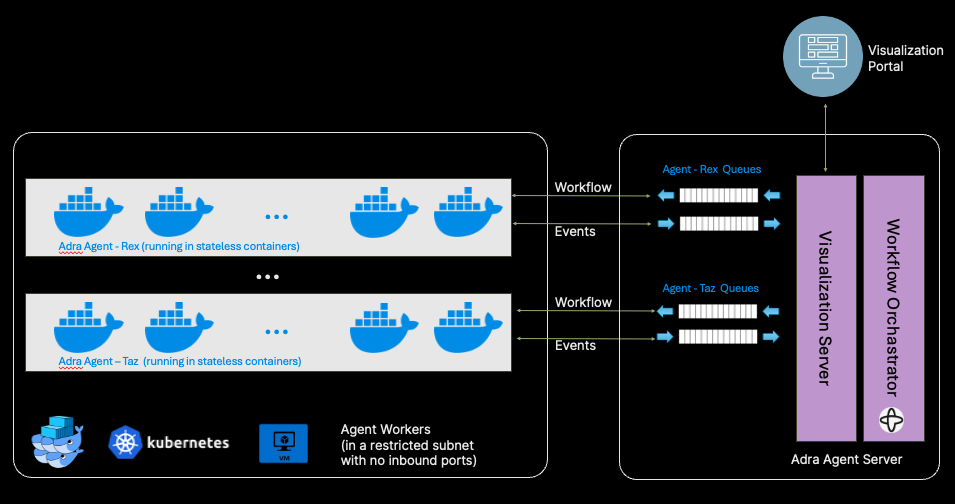

# Scaling Agents

## Overview

Explain the subsystems that has to be scaled to support a large number of agents.

## Agent Workers

The agent workers are responsible for executing the agents. They are stateless and can be scaled horizontally. They are DotNet command line applications that are running in container environment such as Docker or Kubernetes.

## Workflow Orchestrator (Temporal)

The workflow orchestrator is responsible for orchestrating the agents. It is a Temporal server that is responsible for scheduling and executing the agents.

Temporal is high-scale, distributed, durable, and highly available orchestration engine.

Understand temporal's architecture and concepts in the [A Practical Approach to Temporal Architecture](https://mikhail.io/2020/10/practical-approach-to-temporal-architecture/).

Read about scaling Temporal in the [Temporal documentation](https://learn.temporal.io/scaling_temporal/).

Temporal Cluster Architecture:

[Temporal Cluster Architecture](https://medium.com/@pratyaypandey/a-bottom-up-guide-to-temporal-cluster-architecture-74bdb455dc72)

[Temporal at Scale](https://planetscale.com/blog/temporal-workflows-at-scale-sharding-in-production)

## Visualization Server

The visualization server is responsible for visualizing the agents and the workflows. It is a React application with a DotNet backend that is running in the browser.

## Database

The database is responsible for storing the data of the agents and the workflows. It is a PostgreSQL database that is running in the cloud.
