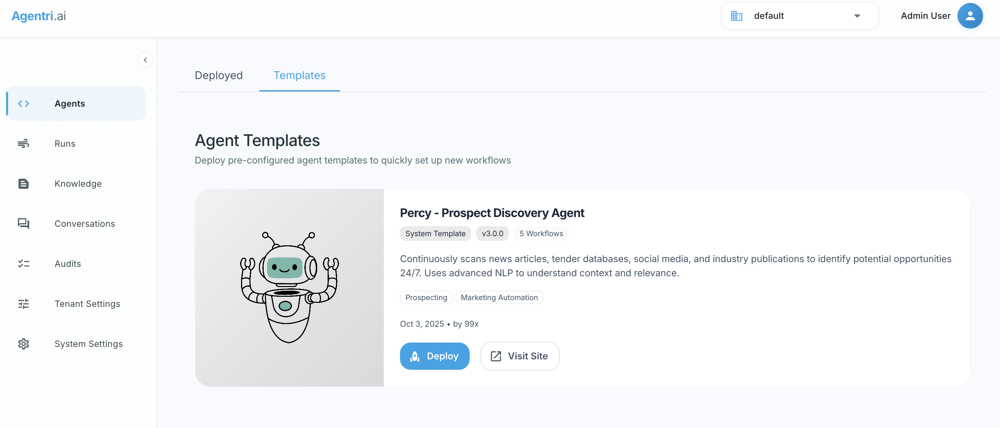

# System-Scoped Agents

## Overview

System-scoped agents are agents that are deployed system-wide as templates rather than being deployed directly to a specific tenant. These agents serve as reusable templates that can be onboarded to multiple tenants, making them ideal for creating agent marketplaces, starter templates, or organization-wide agent libraries.



## Key Characteristics

- **System-Wide Availability**: Deployed once and available across all tenants
- **Template-Based**: Act as blueprints that can be instantiated per tenant
- **Centralized Management**: Updated in one place, available everywhere
- **Onboarding Workflow**: Include guided setup for tenant-specific configuration

## Prerequisites

To create and deploy a system-scoped agent, the developer must have:

- **System Administrator Access**: The API key used for deployment must belong to a system administrator
- Without system admin privileges, the deployment will fail with an authorization error

## Creating a System-Scoped Agent

### Basic Configuration

To create a system-scoped agent, set the `SystemScoped` property to `true` in the `RunnerOptions`:

```csharp
var options = new RunnerOptions 
{
    SystemScoped = true
};

// Create the agent
var agentTeam = new AgentTeam("Percy v4", options);
```

### With Onboarding Configuration

For a complete system-scoped agent with guided tenant onboarding, include the `OnboardingJson` property. It's recommended to organize your onboarding configurations in a static class:

```csharp
public static class Onboarding
{
    public static string Percy = @"
    {
        ""display-name"": ""Percy - Prospect Discovery Agent"",
        ""version"": ""3.0.0"",
        ""description"": ""Continuously scans news articles, tender databases, social media, and industry publications to identify potential opportunities 24/7. Uses advanced NLP to understand context and relevance."",
        ""author"": ""99x"",
        ""license"": ""Proprietary"",
        ""icon"": ""https://agentri.ai/img/theme/percy_icon.png"",
        ""url"": ""https://agentri.ai/"",
        ""tags"": [
            ""Prospecting"",
            ""Marketing Automation""
        ],
        ""workflow"": [
            {
                ""step"": ""knowledge"",
                ""name"": ""Configurations"",
                ""description"": ""Sets the news sources to scan and the recipients of the prospect report."",
                ""url"": ""https://agentri.ai"",
                ""value"": {
                    ""reportRecipients"": [
                        ""user@email.com""
                    ],
                    ""sources"": [
                        {
                            ""name"": ""Shifter"",
                            ""url"": ""https://www.shifter.no/nyheter/""
                        }
                    ]
                }            
            },
            {
                ""step"": ""knowledge"",
                ""name"": ""How To Select Articles"",
                ""description"": ""How to select articles to scan for potential opportunities."",
                ""value"": ""Select articles about any company getting funding to build AI products. Return 'true: <justification>' or 'false: <justification>'. Do not return any other text.""           
            },
            {
                ""step"": ""activate"",
                ""name"": ""Activate the following bots"",
                ""description"": ""Activate the Scheduler Bot to start the agent."",
                ""value"": [
                    ""Percy v3: Scheduler Bot""
                ]
            }
        ]
    }";
}

// Use the onboarding configuration
var options = new RunnerOptions 
{
    SystemScoped = true,
    OnboardingJson = Onboarding.Percy
};

var agentTeam = new AgentTeam("Percy v4", options);
```

## Onboarding JSON Structure

The `OnboardingJson` provides metadata and a guided workflow for tenants to onboard the agent. Here's the structure:

### Metadata Fields

| Field | Type | Required | Description |
|-------|------|----------|-------------|
| `display-name` | string | Yes | User-friendly name shown in the agent marketplace or catalog |
| `version` | string | Yes | Semantic version number (e.g., "3.0.0") |
| `description` | string | Yes | Detailed description of the agent's capabilities and purpose |
| `author` | string | Yes | Organization or individual who created the agent |
| `license` | string | Yes | License type (e.g., "Proprietary", "MIT", "Apache-2.0") |
| `icon` | string | No | URL to the agent's icon/logo image |
| `url` | string | No | Link to documentation, website, or more information |
| `tags` | array | No | Array of strings for categorization and searchability |
| `workflow` | array | Yes | Step-by-step onboarding workflow (see below) |

### Workflow Steps

The `workflow` array defines the onboarding process for tenants. Each step has a specific purpose:

#### Step Types

##### 1. Knowledge Step

Used to configure knowledge base entries, settings, or instructions:

**Example - JSON Configuration:**

```json
{
    "step": "knowledge",
    "name": "Configurations",
    "description": "Sets the news sources to scan and the recipients of the prospect report.",
    "url": "https://agentri.ai",
    "type": "json",
    "value": {
        "reportRecipients": ["user@email.com"],
        "sources": [
            {
                "name": "Example Source",
                "url": "https://example.com"
            }
        ]
    }
}
```

**Example - String/Text Value (without type):**

```json
{
    "step": "knowledge",
    "name": "Selection Criteria",
    "description": "Instructions for selecting relevant articles",
    "value": "Select articles about AI funding. Return 'true: <reason>' or 'false: <reason>'."
}
```

**Example - Markdown Type:**

```json
{
    "step": "knowledge",
    "name": "Article Selection Guidelines",
    "description": "Detailed instructions for article selection",
    "type": "markdown",
    "value": "## Selection Criteria\n\nSelect articles that meet the following:\n- Company funding announcements\n- AI product development\n\nReturn 'true: <reason>' or 'false: <reason>'."
}
```

**Fields:**

- `step`: (Required) Must be `"knowledge"`
- `name`: (Required) Display name for this configuration step
- `description`: (Required) Explanation of what this configuration does
- `url`: (Optional) Link to additional documentation
- `type`: (Optional) Data type - can be `"json"` or `"markdown"`. If omitted, the value is treated as plain text/string
- `value`: (Required) The actual configuration data or instructions. Can be an object (for JSON) or a string

##### 2. Activate Step

Used to specify which agents or bots should be activated after configuration:

```json
{
    "step": "activate",
    "name": "Activate the following bots",
    "description": "Activate the Scheduler Bot to start the agent.",
    "value": [
        "Percy v3: Scheduler Bot",
        "Percy v3: News Scanner Bot"
    ]
}
```

**Fields:**

- `step`: Must be `"activate"`
- `name`: Display name for this activation step
- `description`: Explanation of what will be activated
- `value`: Array of agent/bot names to activate

## Best Practices

### 1. Version Management

Use semantic versioning for your agents:

- **Major version** (X.0.0): Breaking changes or major feature overhauls
- **Minor version** (1.X.0): New features, backward compatible
- **Patch version** (1.0.X): Bug fixes and minor improvements

### 2. Comprehensive Descriptions

Provide clear, detailed descriptions that help users understand:

- What the agent does
- What problems it solves
- Any prerequisites or requirements
- Expected outcomes

### 3. Type Field Usage

The `type` field in knowledge steps is optional:

- **Omit `type`**: For simple string/text values or when the system should infer the type from the value
- **Use `"json"`**: When you want to explicitly indicate structured JSON data that may need validation
- **Use `"markdown"`**: When the content includes markdown formatting that should be rendered appropriately

### 4. Sensible Defaults

Include default values in the onboarding JSON that:

- Demonstrate the expected format
- Work out-of-the-box for testing
- Are clearly placeholder values (e.g., `user@email.com`)

### 5. Clear Workflow Steps

- Order steps logically (configuration → activation)
- Use descriptive names and detailed descriptions
- Provide links to additional documentation when needed

### 6. Tagging Strategy

Use consistent, meaningful tags:

- Functional categories: "Prospecting", "Customer Support", "Data Analysis"
- Industry: "Healthcare", "Finance", "E-commerce"
- Use case: "Automation", "Research", "Reporting"

## Organizing Multiple Agent Templates

For projects with multiple system-scoped agents, organize them in a static `Onboarding` class:

```csharp
public static class Onboarding
{
    public static string Percy = @"
    {
        ""display-name"": ""Percy - Prospect Discovery Agent"",
        ""version"": ""3.0.0"",
        ""description"": ""Continuously scans news articles, tender databases, social media, and industry publications to identify potential opportunities 24/7."",
        ""author"": ""99x"",
        ""license"": ""Proprietary"",
        ""icon"": ""https://agentri.ai/img/theme/percy_icon.png"",
        ""url"": ""https://agentri.ai/"",
        ""tags"": [""Prospecting"", ""Marketing Automation""],
        ""workflow"": [ /* ... */ ]
    }";

    public static string Eli = @"
    {
        ""display-name"": ""Eli - CRM Enrichment Agent"",
        ""version"": ""3.0.0"",
        ""description"": ""Continuously enrich CRM data with additional information."",
        ""author"": ""99x"",
        ""license"": ""Proprietary"",
        ""icon"": ""https://agentri.ai/img/theme/eli_icon.png"",
        ""url"": ""https://agentri.ai/"",
        ""tags"": [""Marketing"", ""Sales""],
        ""workflow"": [ /* ... */ ]
    }";

    public static string Ava = @"
    {
        ""display-name"": ""Ava - Brand Advisor Agent"",
        ""version"": ""3.0.0"",
        ""description"": ""Continuously observe trends and competitor movements and advises on brand strategy and marketing."",
        ""author"": ""99x"",
        ""license"": ""Proprietary"",
        ""icon"": ""https://agentri.ai/img/theme/ava_icon.png"",
        ""url"": ""https://agentri.ai/"",
        ""tags"": [""Branding"", ""Marketing Strategy""],
        ""workflow"": [ /* ... */ ]
    }";
}
```

Then reference them when creating agents:

```csharp
var options = new RunnerOptions 
{
    SystemScoped = true,
    OnboardingJson = Onboarding.Percy  // or Onboarding.Eli, Onboarding.Ava, etc.
};
```

## Example: Complete System-Scoped Agent

Here's a complete example of creating a system-scoped agent with full onboarding configuration:

```csharp
using Xians.Agent.Sdk;

public static class Onboarding
{
    public static string CustomerSupport = @"
    {
        ""display-name"": ""Customer Support Agent"",
        ""version"": ""1.0.0"",
        ""description"": ""An intelligent customer support agent that handles inquiries, provides product information, and escalates complex issues to human agents."",
        ""author"": ""Your Company"",
        ""license"": ""Proprietary"",
        ""icon"": ""https://example.com/support-agent-icon.png"",
        ""url"": ""https://example.com/docs/support-agent"",
        ""tags"": [
            ""Customer Support"",
            ""Automation"",
            ""Chat""
        ],
        ""workflow"": [
            {
                ""step"": ""knowledge"",
                ""name"": ""Support Configuration"",
                ""description"": ""Configure the support channels and escalation rules."",
                ""type"": ""json"",
                ""value"": {
                    ""escalationEmail"": ""support@example.com"",
                    ""businessHours"": {
                        ""start"": ""09:00"",
                        ""end"": ""17:00"",
                        ""timezone"": ""UTC""
                    },
                    ""supportedChannels"": [""chat"", ""email""]
                }
            },
            {
                ""step"": ""knowledge"",
                ""name"": ""Response Guidelines"",
                ""description"": ""Guidelines for how the agent should respond to customers."",
                ""value"": ""Always be polite and professional. If you cannot answer a question, escalate to a human agent. Never make promises about delivery dates without checking availability.""
            },
            {
                ""step"": ""activate"",
                ""name"": ""Start Support Agent"",
                ""description"": ""Activate the support bot to begin handling customer inquiries."",
                ""value"": [
                    ""Customer Support Bot""
                ]
            }
        ]
    }";
}

// Create and deploy the agent
var options = new RunnerOptions 
{
    SystemScoped = true,
    OnboardingJson = Onboarding.CustomerSupport
};

var agentTeam = new AgentTeam("Customer Support Agent", options);

// Add your flows and agents
agentTeam.AddAgent<SupportFlow>();

// Run the agent
await agentTeam.RunAsync();
```

## Tenant Onboarding Process

When a tenant onboards a system-scoped agent:

1. **Discovery**: The agent appears in the agent marketplace/catalog with its metadata
2. **Configuration**: The tenant follows the workflow steps to configure:
   - Knowledge base entries
   - Settings and parameters
   - Custom instructions
3. **Activation**: The specified agents/bots are activated for that tenant
4. **Isolation**: Each tenant gets their own instance with their own configuration
5. **Updates**: System-level updates to the agent template are available to all tenants

## Common Use Cases

### Agent Marketplaces

Create a catalog of pre-built agents that users can discover and deploy:

- Industry-specific solutions
- Common business processes
- Utility agents

### Organization Templates

Provide standardized agents across an organization:

- Consistent tooling across departments
- Centralized updates and maintenance
- Compliance and governance controls

### Partner Integrations

Enable third-party developers to create and distribute agents:

- Ecosystem growth
- Specialized solutions
- Revenue sharing opportunities

## Troubleshooting

### Authorization Errors

**Problem**: Deployment fails with authorization error

**Solution**: Ensure the API key used belongs to a system administrator. Regular user API keys cannot deploy system-scoped agents.

### JSON Parsing Errors

**Problem**: OnboardingJson fails to parse

**Solution**:

- Validate your JSON using a JSON validator
- Ensure all strings are properly escaped (use `@""` verbatim strings in C#)
- Check for missing commas or brackets

### Workflow Steps Not Executing

**Problem**: Onboarding steps don't execute as expected

**Solution**:

- Verify the `step` field contains valid values ("knowledge", "activate")
- Ensure the `value` field matches the expected type for each step
- Check that agent names in "activate" steps match actual deployed agents

## Security Considerations

- **Access Control**: Only system administrators can create system-scoped agents
- **Tenant Isolation**: Each tenant's instance is completely isolated
- **Configuration Validation**: Validate all user-provided configuration during onboarding
- **API Key Management**: Protect system administrator API keys
- **Version Control**: Track and audit agent template changes

## See Also

- [Deployment Options](deployment-options.md)
- [Agent Configuration](agent-context.md)
- [Multi-Flow Agents](multi-flow-agents.md)
- [Scaling Agents](scaling-agents.md)
